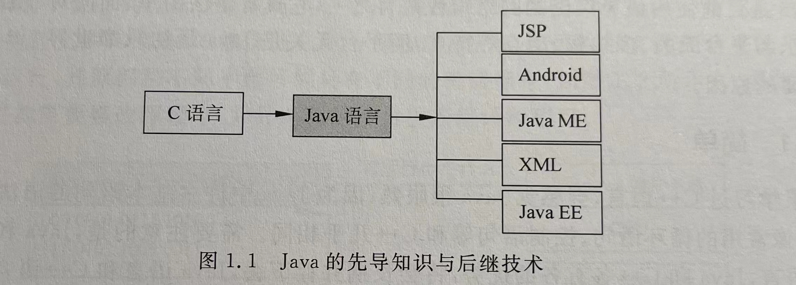
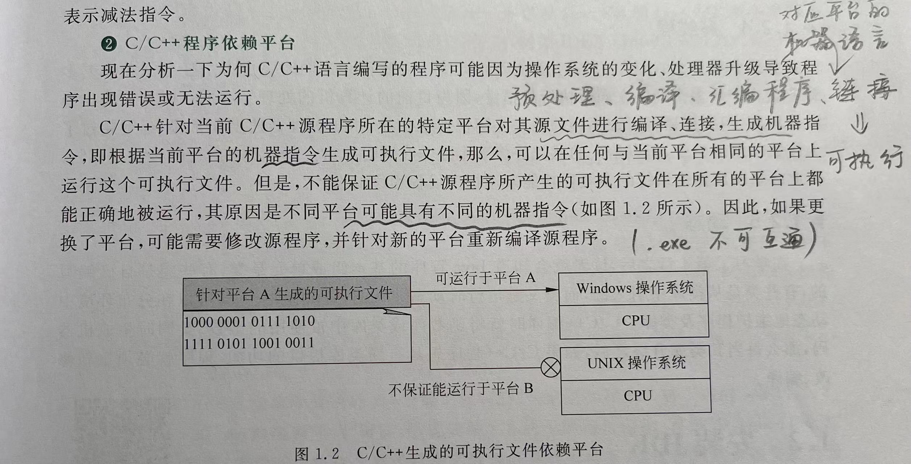
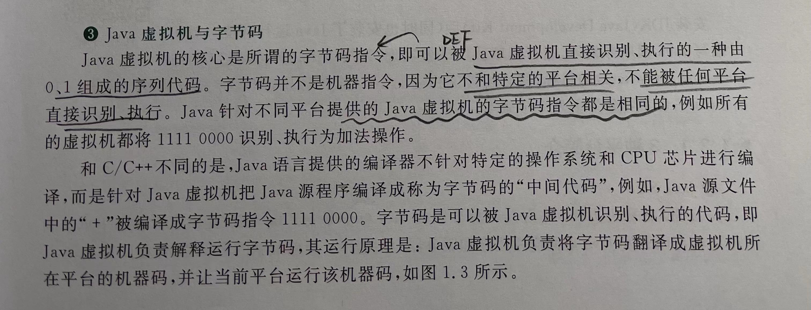
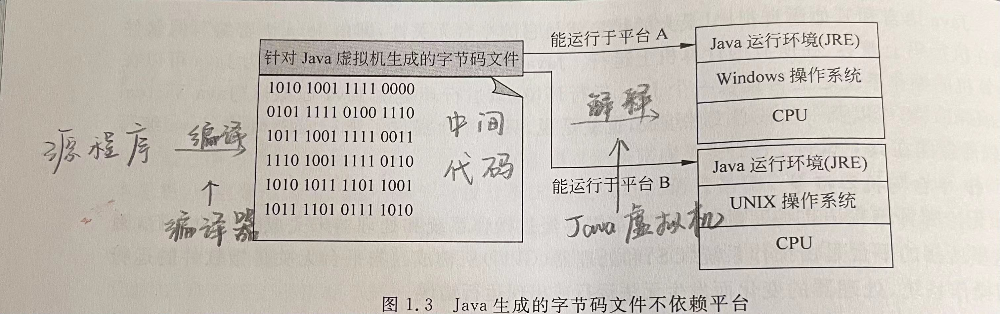
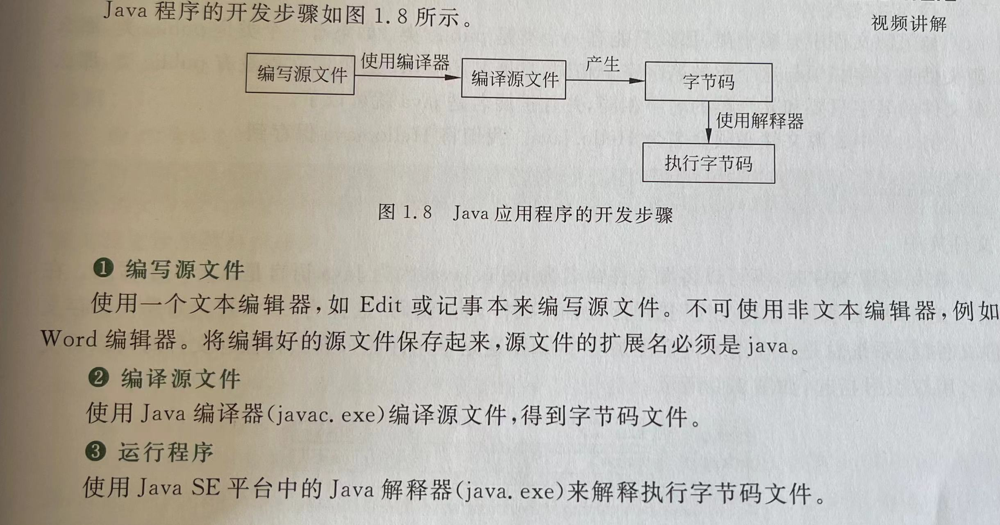
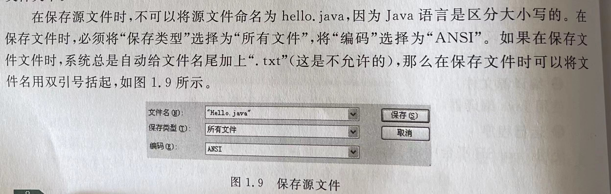
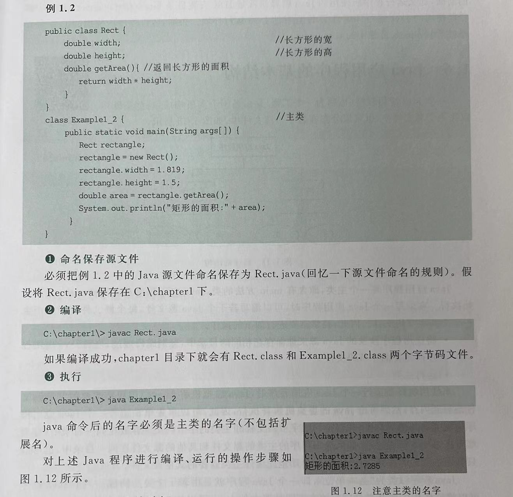
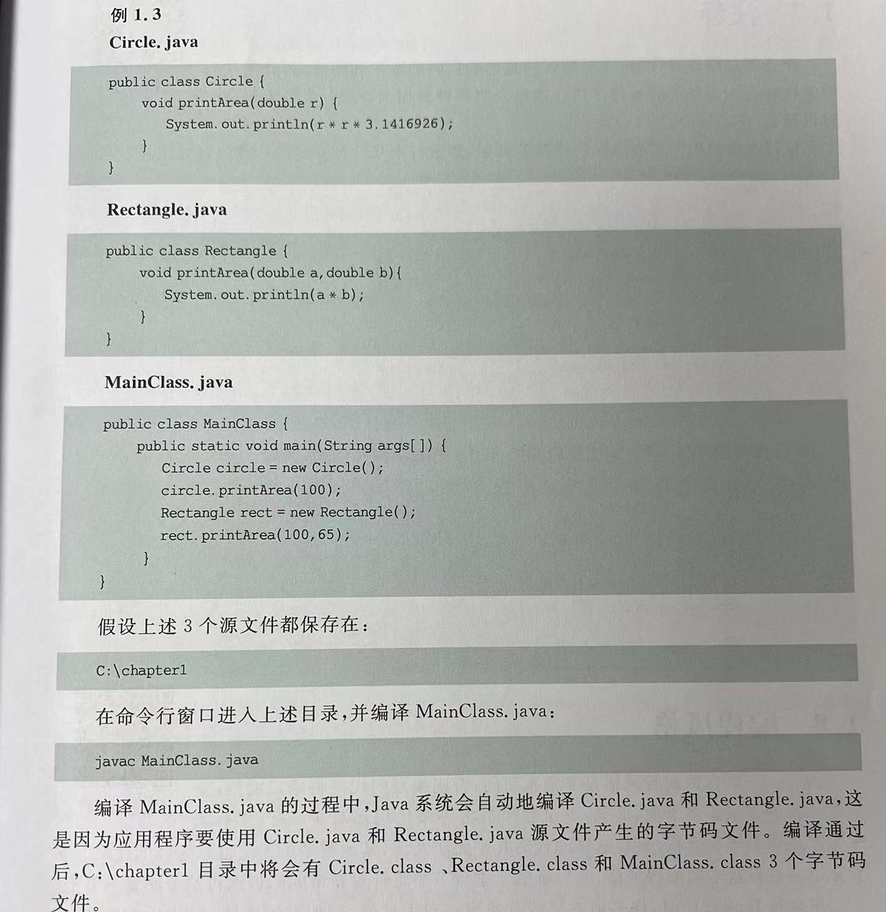

# chapter1 Java概述
Java的位置如下图所示

其中，
JSP-和Web设计相关、Java Me-手机程序设计、XML-数据交换技术相关、Java EE-网络中间件设计相关

## 1.Java的地位
- Java具有面向对象、与平台无关、安全、稳定和多线程等优良特性
- Java不仅可以用来开发大型的应用程序，而且适合Internet的开发

网络；Java的平台无惯性让Java成为编写网络应用程序的佼佼者，且Java也提供了许多以网络应用为核心的技术
需求： Web应用的JSP、设计手机应用的Android、嵌入式开发的Java ME等
__________________
## 2.Java的特点

- **语法简单**
Java中许多语句和C++相同，但Java抛弃了许多C++中许多容易混淆的概念（如Java中不再有指针的概念），或者以一种更清楚、更容易理解的方式实现

- **面向对象**
- **平台无关**
  Java语言的出现源自于**对独立于平台语言的需要**，希望这种语言能编写出嵌入各种家用电器等设备的芯片上且易于维护的程序。
  C和C++都有一个缺点：只能对特定的CPU芯片进行编译，所以一旦设备更换了芯片，就不能保证程序运行正确。
  Java和其他语言相比，最大的优势就是**平台无关性**
> （DEF）即由Java语言编写的软件能在执行码上兼容，能在所有的计算机上运行，不因操作系统和处理器的变化而发生无法运行或错误的情况

  》》Java可以在计算机的操作系统上再提供一个Java运行环境，该运行环境由Java虚拟机、类库以及一些核心文件组成。
  》》只要平台提供了Java运行环境，Java编写的软件就能在其上运行

具体解释如下图：
因每个平台都会形成自己独特的机器指令（0、1序列）。不同的CPU和不同的操作系统所形成的平台的机器指令可能是不同的

·


在一个计算机上编译得到的字节码文件可以复制到任何一个暗转了Java运行环境的计算机上直接使用。
字节码再由Java虚拟机负责解释运行，即Java虚拟机负责将字节码翻译成本地计算机的机器码（有特异性），并把机器码交给本地的操作系统来运行
> 【**程序**--(编译，不针对操作系统，而是Java虚拟机》所有系统中间代码都相同)--->
>  -->**中间代码**（字节码文件）--(解释（翻译一句执行一句），Java虚拟机针对操作系统翻译成机器指令)-->
>  -->**机器指令**】



- **多线程**
  多线程允许同时完成多个任务。但是计算机在同一时刻只能执行一个线程，但处理器可以在不同的线程之间快速切换。由于处理器速度非常快，远远超过了人接受信息的速度，所以给人的感觉好像多个任务在同时执行。

  Meanwhile，C++中没有内置多线程机制，因此必须调用操作系统的多线程功能来进行设计（如Linux中的make -j4命令，使用虚拟机的4个内核多线程完成作业）

- **动态**
  Java程序的基本组成单元是类，有些类自己编写、有些类是从库中引用的，而【类是运行时动态装载的】
  可以让【Java可以在分布环境中动态地维护程序以及类库，不需要从新编译、修改】

  Meanwhile，C++中编译时就将函数库或类库同时生成机器码，那么每次修改类库的时候，C++程序若想要拥有新功能，程序就必须重新编译、修改
___________

## 3. JDK的安装
Java Development Kit (同时安装了Java的运行环境)
为了保障Java的平台无关性（Java虚拟机对中间代码在不同机器上解释成相同的代码（形同的代码可以在不同的机器上解释成相同的含义）），就必须提供Java的运行环境
- Java SE（选择！！）
  Java标准版，提供了标准的JDK，可以开发Java桌面应用程序和服务器应用程序。
- Java EE
  Java企业版，可以构建企业级的服务应用【包含了Java SE ，并增加附加类库，以便支持目录管理、交易管理等功能】
- Java ME
  Java微型版，用于嵌入式系统中（移动电话、无线设备等）
___________________

## 4.简单的Java程序

### 4.1 编写和保存 
- 源文件中如果有多个类，那么只能有一个类是public类！
- 如果有一个类是public，【**那么源文件的名字必须与这个类的名字完全相同**】
- 如果源文件没有public类，那么源文件的名字只要和某个类的名字相同，且扩展名是.java就可以啦！

【小心自动添加了.txt呢！】

### 4.2 编译（要先设置环境变量，让编译器能找到这个文件）
**编译器javac**
在编写了hello.java的源文件之后，使用Java编译器(javac.exe)对其进行编译
step1：打开命令行窗口，进入源文件所在的文件夹
       进入某个子目录（文件夹）的命令是，“cd 目录名”--和linux是一样的呢

**字节码文件（.class文件）**
如果源文件包含多个类，编译源文件将生成多个扩展名为class的文件，每个扩展名是class的文件中只存放一个类的字节码，其文件名和该类的名字相同。这些字节码文件被存放在和源文件相同的目录中。
tip：若源文件有语法错误，不生成字节码文件
     若源文件有修改，则重新编译，再生成新的字节码文件
ex：编译hello.java文件
   》生成hello.class student.class两个文件
tip：JDK5之后的编译器和之前版本的编译器有很大不同，不能再向下兼容。
     高版本编译的字节码文件不能在低版本的Java运行环境中使用，但低版本可以在高版本的环境中使用

**编译多个源文件**
【法一】一次性使用javac一次编译多个源文件，只需要空格+多个文件名
`C:\1000>javac Car.java Person.java`
【法二】编译某个目录下的全部java源文件，使用通配符“*”代表各个源文件的名字来编译全部的源文件
`C:\1000> javac *.java`

### 4.3 运行

**应用程序的主类**
DEF：
一个Java程序必须要有一个类（至少一个，可以多个）含有【public static void main(String args[])方法】
称这个类是应用程序的主类。【S必须大写！！】

其中，args[]是main方法的一个参数，是一个字符串类型的数组
ex:hello.java中的主类是hello
```
public class Hello
{
  public static void main(String args[])
  {
    System.out.println("hello world");
    Student stu= new Student();
    stu.speak("we are future");
  }
}
class Student
{
  public void speak(String s)
  {
    System.outprintln(s);
  }
}
```

**解释器java**
使用java解释器(java.exe)来解释执行其字节码文件。【java程序总是从主类的main方法开始执行】
》》需要进入主类字节码所在目录，例如C:\chapter1 ，然后使用java解释器来运行主类的字节码（即.class文件）
【.java的名字是由public类决定。.class文件的名字是由public static void main()来决定的】
`C:\chapter1\>java Hello`
【当java应用程序中有多个类时，java解释器执行的类名必须是主类的名字！！（不能用扩展名.class）】

> 流程：
> **字节码文件**--java虚拟机 --> **内存**--java解释器-->**解释**

tip:
错误1：Exception in thread "main"java.lang.NoClassFondError
       【没有正确地输入主类名】
错误2：程序通过编译，但无法运行
       【主类中的方法缺少了static!】

以下为编写、编译、运行一个程序的完整过程


________________

## 5.Java应用程序的基本结构
- Java以类作为“基本单位”，一个java程序就是由若干个类组成。
- 一个java应用程序（工程）只有一个主类
- 一个java程序可以将它使用的各个类分别存放在不同的源文件中，也可以把它使用的类存放在一个源文件中。
  同时，从编译的角度看，每个源文件都是一个独立的编译单位，当程序需要修改某个类时，只需要重新编译该类所在的源文件即可，不必重新编译其他类所在的源文件！

ex:以下为多文件编译的例子

--- 因为是3个文件，每个文件中的类都被定义成了public。所以3个文件都得命名成类ming.java
--- 因为MainClass中调用了另外两个java程序，所以编译MainClass之后，系统会自动编译其他两个java文件
--- 因为主函数的MainClass之中，所以最后一步解释器解释的时候应该是
    C:\1000>java MainClass


________________
## 6.注释和风格

**注释**
//     单行
/* */  多行

**编程风格**

1、Allmans风格--独行 风格
```
class Allmans
{
  public static void main(String args[])
  {
    ...
  }
}
```

【代码量小的时候用！代码布局清晰，可读性强】


2、Kernighan风格--行尾 风格
```
class Kernighan{
  public static void main(String[]){
    ...
  }
}
```
【代码量大的时候用！】
如果此时仍要用独行风格，会导致代码左半部分出现大量的左、右大括号，导致代码清晰度下降！


