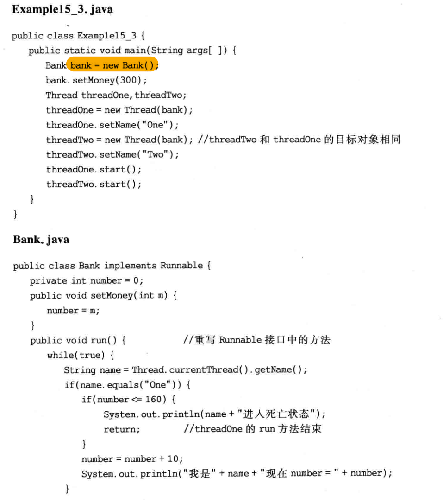

# Chapter 15 Java 多线程机制

 [Chapter 15 Java 多线程机制](#chapter-15-java-多线程机制)auto    - [15.1 Java中的线程](#151-java中的线程)
 auto    - [15.2 用Thread的子类创建线程](#152-用thread的子类创建线程)
 autoauto<!-- /TOC -->

多线程：同时存在几个执行体，按几条不同的执行线索共同工作
单核计算机在任何时刻只能执行这些线程中的一个

本例子中，程序若可以创建两个线程，每个线程分别执行一个while循环，那么两个循环就都有机会执行。
Java虚拟机（JVM）负责管理这些线程，这些线程将被轮流执行，使得每个线程都有机会使用CPU资源

## 15.1 Java中的线程

每个Java程序都有一个默认主线程：当JVM加载代码，发现main方法后，启动一个进程【主线程！】
此后在main方法的执行中再创建的线程，就称为程序中的其他线程
- main中没创建其他线程，main执行完最后一个语句（返回），JVM结束Java应用程序
- main中创建了其他进程，JVM一直等待程序中所有线程都结束才结束Java应用程序！

### 15.1.1 线程状态 & 生命周期

**Java使用Thread类 及其 子类对象来表示线程**

1. **新建**
   用Thread类或其子类的对象被声明并创建时，新的线程对象处于新建状态。
   此时，已经拥有了对应内存空间 & 其他资源

2. **运行-start()&重写run()**
   一旦轮到此线程先用CPU资源，即JVM把CPU使用权切换给该线程，此线程可以脱离创建它的主线程独立开始自己的生命周期。
   > **调用start()方法**：
   > 从父类Thread中继承的方法，告诉JVM又有一个新线程排队等待切换了

   > **重写run()方法**：
   > 如果此线程是Thread子类创建的，JVM把cpu使用权给线程时，该类中的run()方法立刻执行。父类的run没有具体内容，程序重写run()方法来覆盖父类的run()方法！【规定了线程的具体使命】

3. **中断-sleep()、wait()、notify()**
   - situation 1：JVM把CPU资源从当前线程切换给其他线程
   - situation 2：线程主动执行**sleep(int millsecond)**方法，立刻让出CPU使用权，使线程处于中断状态。在过了millsecond指定的毫秒数之后，线程重新加入到等待队列中等待CPU资源
   - situation 3：线程主动执行**wait()**方法，使得当前线程进入等待状态（blocked queue）。调用后不会主动回到等待队列，必须由其他线程调用**notify()**,才可让此线程再进入等待队列（waiting queue）
   - situation 4：线程使用CPU资源期间，执行某个操作进入阻塞状态。ex：执行读、写操作引起阻塞。等阻塞原因消除，线程才重新进入等待队列

4. **死亡**
   - situation 1：执行完run()方法中所有语句，结束了run方法
   - situation 2：线程被提前强制性终止，强制run()方法结束

### 15.1.2 完整的例子

### 15.1.3 线程调度 & 优先级

调度器把线程优先级分成10个类别，用**Thread类的类常量**表示
Thread.MIN_PRIORITY
Thread.MAX_PRIORITY
Thread.NORM_PRIORITY:没有明确设置线程优先级别时，每个线程优先级都为常数5

优先级设置可以通过**setPriority(int grade)**方法调整

## 15.2 用Thread的子类创建线程

### 15.2.1 优点 & 不足
优点：
可以在子类中增加新的成员变量，使线程具有某种属性。
也可以在子类中增加方法，使线程具有某种功能

不足：
Java不支持多继承，Thread类的子类不能再扩展其他的类

### 15.2.2 例子
一个例子：
两个线程，共享一个StringBuffer对象，两线程在运行期间修改StringBuffer对象中的字符。同时主动调用sleep(int n)方法让出CPU的使用权进入中断状态（sleep(int n)是Thread类的静态方法）

其中str一开始是空的，不断往其中加入当前线程名字

## 15.3 使用Runnable接口

TODO：使用Thread类直接创建线程对象
`Thread(Runnable target)`
**参数**：Runnable类型的接口的实例---所创线程的目标对象

**作用**：一旦得到CPU资源，目标对象就会自动调用接口中的run()方法。用户不需操作，只需让线程一开始调用start方法即可

**例子：**
threadOne和threadTwo两线程使用同一个目标对象，两个线程共享目标对象的成员变量number。
threadOne-递增number。number值<150，结束run()进入死亡状态
threadTwo-递减number，递减速度大于递增速度。number<0，结束run()进入死亡状态

