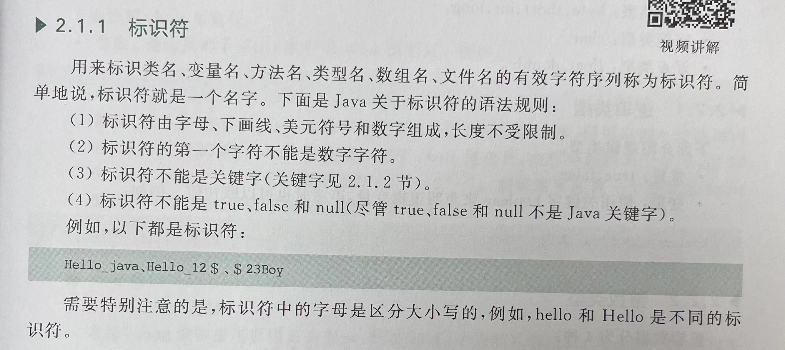
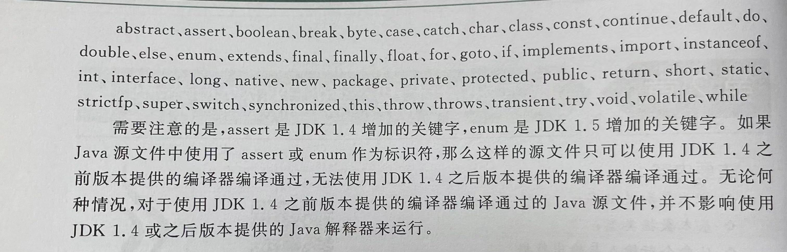
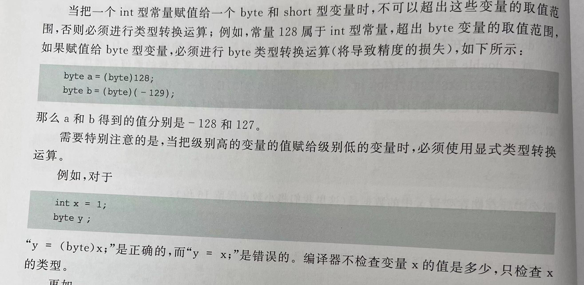
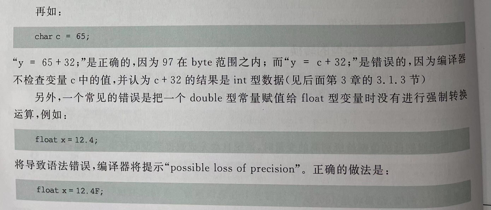
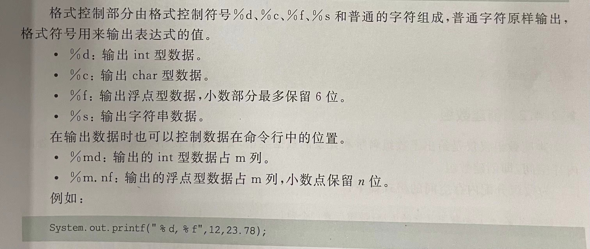

# Chapter2 基本数据类型、数组和枚举类型

## 1. 标识符和关键字

**标识符**

tip:java中是允许以中文作为变量的名字的！！！只是不是很规范，尽量不要使用
【使用Unicode字符表，所以只要在Unicode之中的字符（汉字，韩文等）都可以被表示呢！】

**关键字**
java中已经被赋予特定意义的一些单词，不能把关键字作为标识符来用


___________________________

## 2.基本数据类型
8种基本数据类型
- 逻辑类型：boolean
- 整数类型：byte short int long
- 字符类型：char
- 浮点类型：float double

### 2.1类型
**逻辑类型**
常量：true、false
变量：`boolean x,ok=true;`【可以多个值同时被一个值同时赋予】

**整数类型**
①int：分配4个字节，共32个bit
（正常的常量）
变量定义：`int x=10;`

②byte：分配一个字节，共8个bit【表示范围，-2的7次方~2的7次方-1】
（不存在常量，但可以强制转换运算的结果，如(byte)-12）

变量定义：`byte x=-12;`

③short：分配两个字节，共16个bit【表示范围，-2的15次方~2的15次方-1】
（不存在常量，但可以强制转换运算的结果，如(short)-12）

变量定义：`short x=12;`
【**和C语言中没有差别！**】


④long：分配八个字节，共64个bit【表示范围，-2的63次方~2的63次方-1】
（常量，后缀要以L来表示，如108L,07123L,0x3ABCL）八进制和十六进制
【需要用后缀L来表示！】
变量定义：`long width=12L;`

**字符类型**
①常量：
被单括号括起来的Unicode的字符
'A','好'，'?','!'...

②变量：
使用关键词char来声明char型变量
`char ch='家',home='A';`
【**区别：C语言中给char分配一个字节！**】
分配两个字节，共16位，最高位不是符号位（区别于C哦，此时没有signed char啦！），没有负数的char
char型变量的取值范围是0~65535

tip:
`char x=97;`97是字符a在Unicode表中的排列位置，和`char x='a';`是一样的呢！

> char可以作为一个字符->它对应的ASCII码的转换函数呢！如char('w')=969

**浮点类型**
- float：
  常量: 后面必须加上f或F!!!
  ex: 231.01f
  变量：使用float来声明
  ex:float x=22.76f;
  在存储的时候，保留8位有效数字，（多了会被截断）
  分配4个字节，共32位

- double：
  常量：允许省略后缀！！！（如果没有说明的小数，就是double啦！）
        当然，也可以加上d或者D，ex：123.15D
  变量：同常量
  ex:double x=1.1;
  在存储的时候，保留16位有效数字，（多了会被截断）
  分配8个字节，共64位

### 2.2基本数据类型的转换
`byte short char int long float double`
以上数据类型精度从低->高！
**situation1**：从低-》高，系统自动完成数据类型的转换！
    ex:float x=100;(输出100.0)
**situation2**：从高-》低，显示类型转换运算【强制转换，会导致精度的损失】
`（类型名） 要转换的值;`

> 常见的错误1：超过了表示范围
> --此时不能通过系统的自动类型转换！
> --可以通过强制类型转换，但是也会造成精度的损失！


> 常见的错误2：没有使用显示类型转换
！尤其float 的变量的赋值会出现问题！

也可以表示成`float x=(float)12.4;`


________________

## 3. 输入输出

### 3.1 输入 基本型数据
`***可以使用Scanner类创建一个对象（是一个在java.util包中的类）`
step1:创建一个对象，`Scanner reader =new Scanner(System.in);`

step2：使用reader对象调用以下方法，读取命令行输入的各种基本类型数据
`nextBoolean(),nextByte(),nextShort(),nextInt(),nextLong(),nextFloat(),nextDouble()`

- 分割标记：上面的reader以空白作为分隔标记，读取当前程序的键盘缓冲区的“单词”。
  把当前程序的键盘缓冲区中的字符序列分隔成若干个独立的“单词”。reader对象每次调用上述方法都从键盘缓冲区读入下一个“单词”【如果符合要求，就返回；不符合，就触发数据读取异常】

- 堵塞状态：调用上述方法，但是键盘缓冲区没有单词可读，需要等待用户在命令行输入新的数据


> 调用hasNext...()来判断下一个“单词”是否符合next...()所要求的数据。
> 如果符合要求，hasNext...返回true，否则返回false
> `hasNextBoolean(),hasNextByte(),hasNextShort(),...,hasNextDouble()`
> tip：这个方式也符合精度匹配

```
import java.util.Scanner;
public class Example{
  public static void main(String args[]){
    System.out.printIn("用空格分隔输入");
    Scanner reader=new Scanner(System.in);
    double sum=0; int m=0;
    while(reader.hasNextDouble()){
      double x=reader.nextDouble();
      m=m+1;
      sum=sum+x;
    }
    System.out.printIn(...);
  }
}
```

### 3.2输出 基本型数据

【法一】`System.out.println()或System.out.print()`可以输出串值、表达式的值
>System.out.println()--输出数据之后 换行
System.out.print()--输出之后 不换行

- 可以使用“+”将变量、表达式或者一个常数值与一个字符串一起输出

  System.out.println(m+"个数的和为"+sum);

- 不可以出现回车，否则无法通过编译
  
- 如果字符串比较长，可以把字符串分成几部分，然后使用并置符号“+”把他们首尾相连

【法二】`System.out.printf("格式控制部分",表达式1,表达式2);`【C语言中和printf相似的数据输出方法】



________________________________

## 4.数组
相同类型的变量按照顺序组成一种符合数据类型，索引从0开始

### 4.1 声明数组
DEF：仅仅给出了数组的名字和元素的数据类型！没有被分配空间！！！
一维数组：
```
数组元素类型 数组名字[];

数组元素类型[] 数组名字;
```

二维数组：(数组的数组，一个二维数组是由若干个一维数组构成的)
```
数组的元素类型 数组名字[][];

数组的元素类型[] []数组名字;
```

- 数组的元素可以存放Java中任何一种类型，加入已经声明了一种People类型的数据，那么可以声明如下一个数组
      People china[];
> **Java不允许在声明数组中的方括号中指定数组元素的个数！！！**
> ex: int a[12]; 导致语法错误！！！

### 4.2 创建数组
DEF：分配内存空间，即创建数组。创建数组之后才可以真正使用！！！
`数组名字 = new 数组元素的类型[数组元素个数];`


- **【数组的数组，一个二维数组是由若干个一维数组构成的】**
```
int mytwo[][];
mytwo=new int [3][4];
3个长度是4的一维数组mytwo[1],mytwo[2],mytwo[3]
```

- **【构成二维数组的一维数组不必有相同的长度，在创建二维数组时可以分别指定该二维数组的一维数组长度】**
```
int a[][]=new int[3][];//声明和创建二维数组被放在了一起！
但是他们的长度还没有确定，即【这些一维数组还没有分配内存空间，所以二维数组a还不能使用】
必须创建它的3个一维数组
a[0]=new int[6];
a[1]=new int[12];
a[2]=new int[8];
```

- 和C语言不同（最新C语言的标准已经是允许的了）,Java与允许使用int型变量的值指定数组元素的个数
```
int size=30;
double number[]=new number[size];
```

### 4.3数组元素的使用

#### 4.3.1 length的使用
一维数组，“数组名字.length”是数组中元素的个数
二维数组，“数组名字.length”是它含有的一维数组的个数

#### 4.3.2 数组的初始化

①单个元素分别赋值，注意float、long后面都有后缀f和l

②在**声明**数组的时候同时给数组的元素赋值！【就相当于在声明数组的时候同时完成了对数组的创建！！！】
`float boy[]={21.3f,34.89f}`

```
相当于
float boy[]=new float[5];
boy[0]=21.3f ;boy[1]=2.0f;...
```

③若干个一位数组初始化一个二维数组，这些一维数组的长度可以不尽相同。
```
int a[][]={{1},{1,1},{1,2,1},{1,4,6,4,1}};

```


#### 4.3.3 数组的引用和整体输出

- 两个相同类型的数组如果具有相同的引用，他们就有完全相同的元素
  ```
  int a[]={1,2,3},b[]={4,5};
  此时，数组a和b分配了不同的内存空间，内存模型中并不相同
  但是，如果
  a=b;
  【a中存放的引用和b相同，这是系统会释放最初分配给数组a的元素，使得a的元素和b的元素相同，即&a和&b引用的内存是相同的地方】

  ```

> 对于除了char型的数组，使用System.out.println(a)输出的是数组a的首地址（即对数组a的引用），如[@de6ced 
> 但对于char类型的数组，System.ou.println输出的是数组a的所有元素的值！！！
> 如果想输出char类型数组的引用，必须让数组a和字符串做并置运算（通过“+”连接起来）
> ex:System.out.println(""+a);


- 整体输出：
整体输出，无需循环
`【方法！】让Arrays类调用： public static String toString(int[] a);`
`需要 import java.util.Arrays; `

可以得到如下格式的字符串：
int a[]={1,2,3,4,5,6};
**System.out.println(Arrays.toString(a));**
得到的是[1,2,3,4,5,6]

#### 4.3.4 复制数组

- 法一：地址引用（后者元素值的改变影响原数组的值）
  ```
  int a[]={1,2,3},b[];
  b=a;
  这样a和b是对同一个数组的引用，改变a元素的值，同时b的值也会被改变
  ```

- 法二：值复制（后者元素值的改变不影响原数组的值）
  **arraycopy方法**
  好处：不需要import，这是system自带的函数
  不足：需要事先创建参数copyArray指定的数组

  `让System类调用方法：public static void arraycopy(sourceArray,int index1,copyArray,int index2,int length)`
  其中：将数组sourceArray从索引index1开始的length个元素赋值到copyArray中
        （即把下标从index1 到 index1+length-1元素中的数据复制到数组copyArray中）
        copyArray数组从第index2元素开始存放这些数据。
        如果copyArray不能存放复制的数据，程序运行将发生异常
```
import java.util.Arrays;
public class test{
  public static void main(String args[]){
    char a[]={'a','b','c'},b[]={'1','2','3','4'};
    System.arraycopy(a,0,b,0,a.length);
    System.out.println(Arrays.toString(a));
  }
}
```

> 和python一样，可以使用*把所有的函数都import进来呢
> import java.util.*;(这样就包含了util.Arrays这个库呢！)


 **copyOf和copyOfRange方法**
 好处：不需要事先创建新数组
 坏处：是在Arrays类的方法中，需要import java.util.Arrays;

 `public static double[] copyOf(double[] original,int newlength)`
 ·其中：double可以换成int、float、char呢！·
 其中：
     把参数original指定的数组中从索引0开始的newlength个元素复制到一个新数组中，并返回这个新数组，而 且这个新数组的长度为newlength
 如果newlength的长度超过了original数组的长度，那么copyOf方法返回的新数组中，超过original长度的数组元素都取默认值！！！
```
int a[]={100,200,300};
int b[]=Arrays.copyOf(a,5);
b的前三个元素和a一样，后两个都取默认值0！
```

 `public static double[] copyOfrange(double[] original,int from,int to)`
 好处：不需要事先创建新数组
 坏处：是在Arrays类的方法中，需要import java.util.Arrays;
 ·其中，double可以换成int、float、char呢！·
 其中：把参数original指定的数组中从索引from到to-1的元素复制到一个新数组中，并返回这个新数组
       新数组的长度是to-from。如果to的值大于数组original的长度，新数组下标超过original。length -from的元素，值都取默认值！
```
int a[]={100,200,300,400,500};
int b[]=Arrays.copyOfRange(a,2,5);
b的长度是3，是a的第三个到第5个元素（下标是5-1的元素呢！）
```

#### 4.3.5 排序和二分查找

**快速排序**
`使用Array类调用：public static void sort(double a[])`
或者
`使用Array类调用：public static void sort(double a[],int start,int end)`
本方法：把索引从start到end-1的元素按照升序排序！

**二分查找**
`使用Array类调用：public static int binarySearch(double[] 1,double number)`
本方法：首先看看number在不在数组a之中，如果在的话返回该元素的索引。
        如果不在的话，返回-1

_____________________________

## 5. 枚举类型
**enum声明枚举类型**
```
enum 枚举名
{
  常量列表
}

```

**枚举变量赋值**
```
枚举类型 变量名;
变量名=枚举类型.常量;
```

ex:
```
enum Season{
 spring,summer,autumn,winter
}
Season x;
x=Seanson.spring;
```
区别于C和C++，他俩创建了枚举变量之后，直接给这个枚举变量赋予一个字符常量（在枚举类型中的）就可以啦
Java还是得通过属性调用的方式来初始化呢！


【补充import自定义模块】
> animals包下有两个类，一个是Animal，另一个是MammalInt类，假设Array类中要引用animals包中的某个类，应该如何导入：import animals.Animal;

//采用class来定义类的名称
//Array类的名称
public class Array {
public static void main(String[] args) {
}}
>或者可以用.* 表示通配，即导入包中的所有类。如：import animals.*;


  


