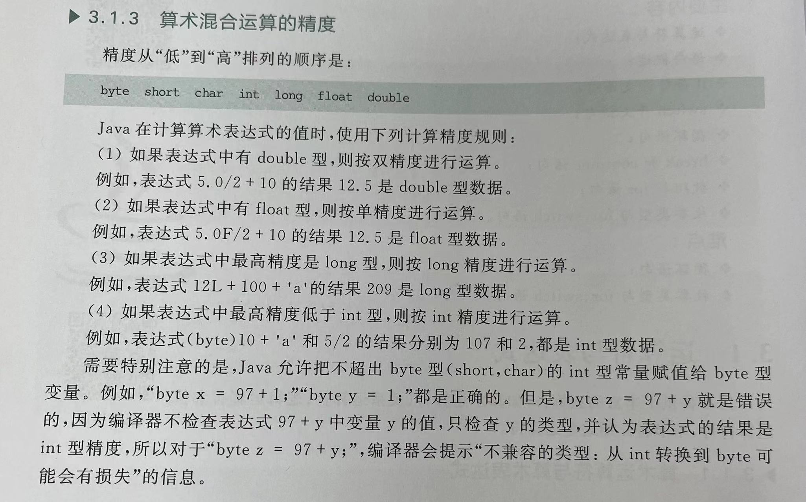
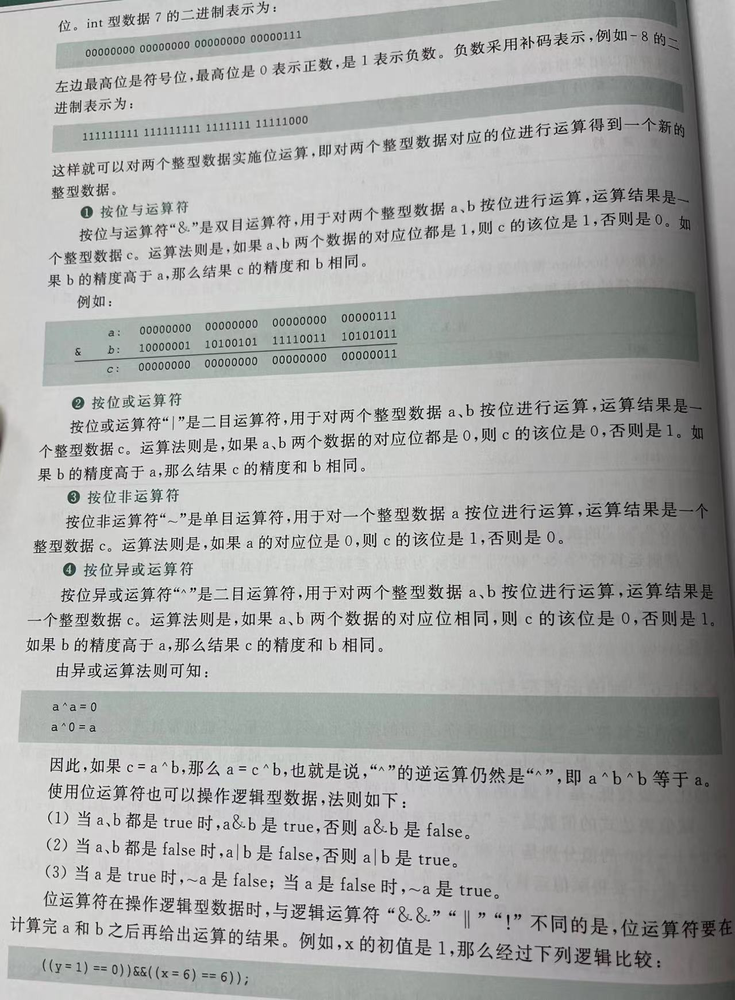
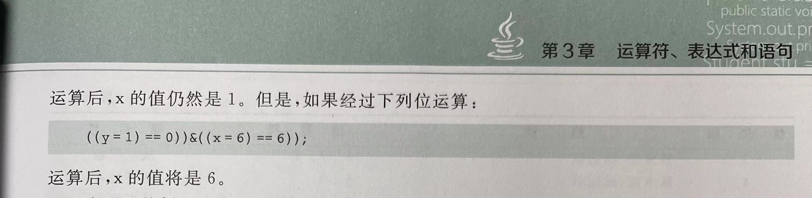
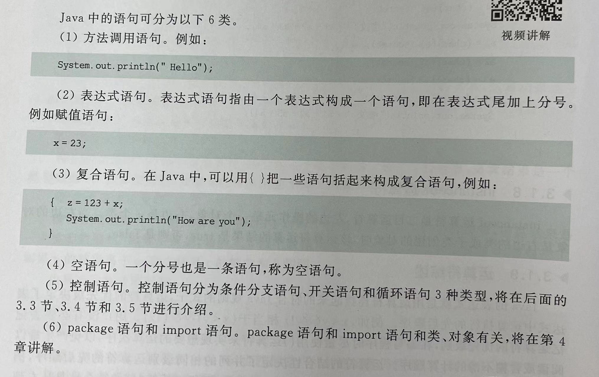
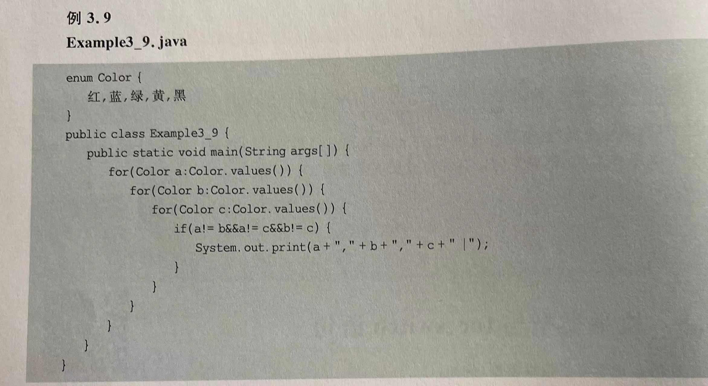
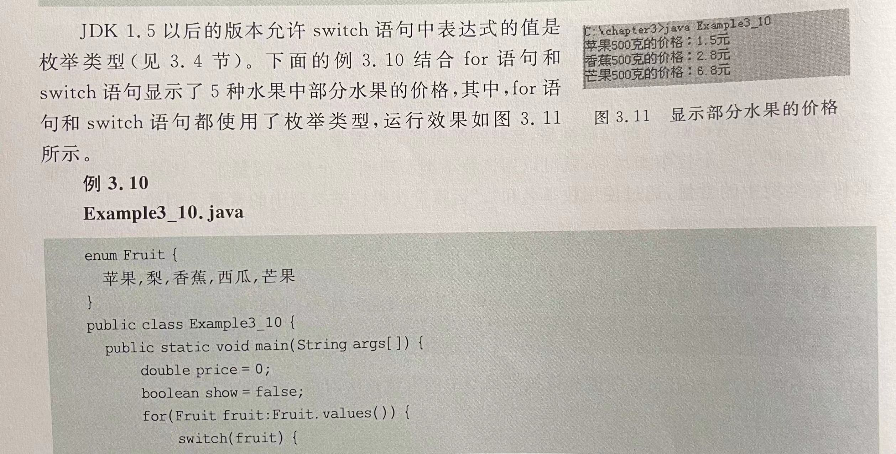
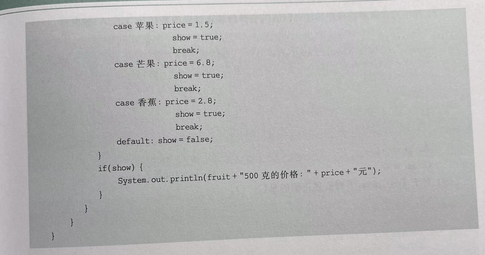

# Chapter3 运算符、表达式和语句
本小节仅做对C++的补充

## 1.运算符和表达式

**算术混合运算的精度**


**位运算符**(数据都是补码表示的呢！)



**instanceof运算符**（非常有用呢！）
`a isinstanceof A`
二目运算符，左边的操作员是一个对象，右边是一个类。
```
double d=0.0001
if(d isinstanof double)
```
__________________

## 2.语句
Java中的语句分为以下6种


**开关语句switch**
```
switch(表达式)
{
   case 常量值1：
                若干语句
                break;
    ...
    default:
                若干语句 
}
```

- 表达式中的值可以是byte\short\char\int\枚举类型和String类型（此处就是字符常量喽）！！！【不允许double和long的形式！！！】
  其中常量和常量的匹配只能是以“enum中定义的形式”，而不是他所对应的整数！


**do...while...**
```
do{
    若干语句
} while;//此处需要加引号哦！
```
_______________________

## 3.数组与for语句（JDK中新定义的）
```
for(声明循环变量：数组的名字)
{
    ...
}
tip：不可以把声明放在for的外边呢！
```
其中，声明的循环变量的类型必须和数组相同！！！
**理解：对于循环变量依次取数组的每一个元素的值！！！**，此时i就代表了a[i]了呢！（是取的数组中元素的值）

```
public class test{
    public static void main(String args[]){
        int a[]={1,2,3,4};
        for(int i:a){
            System.out.println(i);
        }//循环变量i，依次取数组a的每一个元素的值！！！
    }
}
```

______________________

## 4.枚举类型和for、switch语句
`枚举类型的名字.values()`
返回一个数组，该数组元素的值和枚举类型中的常量一一对应！

ex:
weekday a[]=WeekDay.values();
此时a[0]-a[6]分别对应着sum\mon\tue...sat



