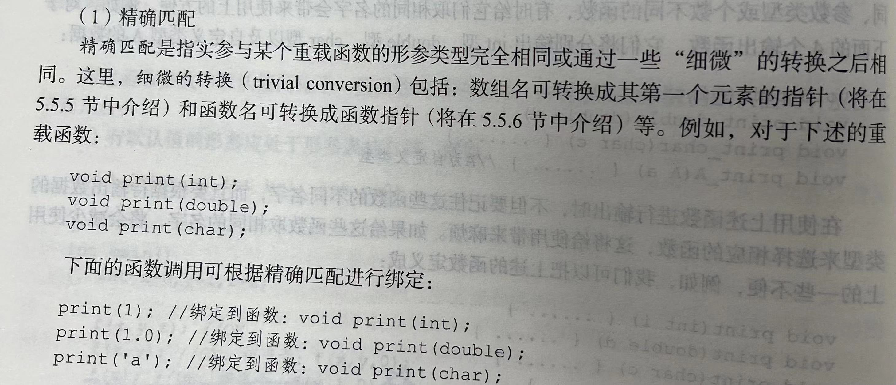

# Chapter1 指针之前

## 1.基本数据类型和表达式

基本数据类型较C增加了：逻辑类型 、 空值类型
构造数据类型没有增加
抽象数据类型增加了：类 和 派生类【支持面向对象】

### 1.1 基本数据类型

- 整数类型：
  int \ short int或short \long int 或 long
  unsigned int或unsigned \ unsigned short int \ unsigned long int

- 实数类型：
  float \ double \ long double

- 字符类型：
  char 单字节编码字符集中的字符类型数据
  unsigned char  \  signed char 在参加算术运算的时候，把字符的编码当做有符号整数还是无符号整数来看待

【补充】
Unicode 国际通用大字符集：包含了大部分语言文字中的字符（英文、中文、日文），2-4字节编码

- 逻辑类型：
  bool

- 空值类型（void）：
  void 没有返回值的函数返回值类型
  void* 通用指针类型

### 1.2数据表现形式

**常量**
- 字面常量
  DEF：程序中直接写出常量值的常量
  整数类型字面常量、实数类型字面常量、字符类型、字符串类型字面常量

- 符号常量
  DEF：有名字的常量。在程序中可以通过给常量取一个名字并指定一个类型，然后通过使用这些名字来使用常量
  ```
  const <类型名> <常量名>=<值>;
  或
  #define <常量名>=<值>;
  ```
  ex:
  const double PI=3.14;
  #defien PI=3.14;
  【因使用const，编译程序能够对常量的使用进行更严格的类型检查，所以通常采用第一种常量定义的形式】
  【bool类型也可以看成是C++预定义的两个符号常量，值分别是1和0】


_________________

## 2.程序的流程控制描述-语句

### 2.1 if
多层if-else是通过
if...
else if
else if
else
来使用的呢

### 2.2 无条件转移
goto continue

- goto：
  ```
  goto <语句标号>;
  <语句标号>:<语句>
  ```
  ex:
  goto L1;
  L1:
  【不能用goto语句从一个函数外部转入到函数的内部，也不能从函数内部转到外部】【不可以跨函数使用goto】
  > 可以从内层复合语句->外层复合语句（退出多重循环！！！）。
  > 但goto不能跳过带有初始化的变量定义！！！
  > 如下图所示：

- continue:
  DEF：用在循环体语句中，立即结束当前循环，准备进入下一次循环


__________________________

## 3.过程抽象-函数

### 3.1 局部变量和全局变量

- 在定义全局变量之前使用要进行声明：
  `extern <类型名> <变量名>;`（属于非定义声明）
  》》使得编译程序能对变量的操作进行类型检查以及生成高效的可执行代码

- 函数副作用：
  DEF：函数改变了函数调用者的数据（通过在函数中改变非局部变量的值）

### 3.2 多模块结构
【原则】：按照某种规则对 “全局变量”、“函数及其类型”的定义进行分组，分别放到若干个源文件中
编译程序对每个源文件分别进行编译，编译后通过一个连接程序把“它们各自的编译结果”以及“程序中用到的C++标准库中的代码”连接成一个可执行程序

【模块划分原则】
模块内部内聚性最大（模块内部各个实体之间的管理按程序）
模块之间耦合度最小（各模块之间的一类程序）

> 模块：两个文件-头文件（.h 存储模块接口） 、 源文件（.cpp 存储模块实现）
> 在一个模块中如果要用另外一个模块中定义的全局程序实体，就可以在前者的源文件中用一条编译预处理命令-
> #include，把后者的【头文件】的内容包含进来，达到声明的目的
```
//file.h
extern int x;
extern double y;
int f();

//file1.cpp
int x=1;
double y=2.0;//全局变量x和y
int f()
{
    ...
}

//main.cpp
#include "file1.h"//这样就已经把file1中定义的函数和全局变量，又定义，又声明啦！
int main()
{
    ...
}
```

【补充】
C和其他语言的要求，函数体或复合语句之中，局部数据的定义必须几种写在所有语句的前面！！
如for（i=0;...;...）中不能写int i=0;否则会报错！
C++可以随用随定义！

### 3.3 变量的生存期
DEF:程序运行时一个变量占有内存空间的时间段称为该变量的生存期

- 静态生存期：从程序开始执行时就进行分配，结束时才收回他们的空间（全局变量）
- 自动生存期：执行到定义他们的复合语句才分配空间。复合语句结束的时候，空间才会被收回（局部变量、函数参数）
- 动态生存期：内存空间使用new或malloc分配，delete或free来收回

定义局部变量的时候，有以下存储类修饰符
1.auto：自动生存期，没有指定存储类的时候，默认是auto
2.static：静态生存期
3.register：建议编译程序把相应的局部变量的空间分配在CPU的寄存器中，提高对局部变量的访问效率

其中，static有两个用处：
① 在全局变量中，static修饰符只让这个变量在本文件中可以使用（文件作用域），别的文件调用此文件时，不可使用这个全局变量
ex：
如果上面file.cpp中定义的是static int x;这样引用file.h的时候，全局变量x也不能被main使用！

② 在局部变量中，static修饰符让这个局部变量变成了这个函数中的全局变量
【且多频繁初始化此变量，只在第一次初始化的时候有效的！】
```
ex:
void f()
{
    extern int x;
    ...//此时可以使用x
    static int x=1;
    ...
}
//此时不能使用x
```


### 3.4带参数的宏、内联函数、带默认值的形参
由于函数调用时需要开销的（保护调用者的运行环境、指令调用、分配空间...），会带来程序执行效率的下降，特别是一些小函数的频繁使用更加严重啦
为解决上述问题：提供了“带参数的宏”以及“内联函数”来解决

#### 3.4.1 带参数的宏
```
#define <宏名> (<参数表>) <文字串>
``` 
把出现“宏名”的地方用“文字串”进行替换
在“文字串”中出现的，由“参数表”列出的参数（形参），将被替换成使用该“宏名”的地方所提供的的参数（实参）

ex：
`#define max(a,b) (((a)>(b))?(a):(b))`
此时必须一个“变量”有一个括号，以防a和b是一个表达式，引起优先级错乱的问题呢


#### 3.4.2 内联函数
DEF:函数定义中的返回值类型之前加上一个关键字incline
》》【建议编译程序把该函数的函数体展开到调用点】
》》【避免函数调用的开销，提高函数调用的效率】

```
incline int max(int a,int b)
{
    return a>b?a:b;
}
```
> 优点：
> 【形式上属于函数，效果上具有宏定义的高效率！】
> 缺点：
> - 编译程序对内联函数的限制
> - 具有文件作用域！


#### 3.4.3 带默认值的形参
DEF:在定义或声明函数的时，为函数的某些参数指定默认值。如果调用这些带默认形参的函数时没有提供相应的实参，则相应的形参采用指定的默认值。否则，采用调用者提供的实参
```
声明时：
void print(int value,int base=10);
定义时（除非在调用之前定义，同时充当声明，否则默认值不算数！！！）：
void print(int value,int base=10)
{
    ...
}
```
- 有默认值的应该处于形参表的最右侧！！
- 【对参数默认值的指定只在函数声明处有意义。函数定义时指定参数默认值没有意义！
  除非在调用之前定义，同时充当声明，否则默认值不算数！！！】
- 不同文件，可以对同一个函数，有不同默认值的声明！！！
```
ex:
//file.cpp
void f(int a,int b)
{
    ...
}

//file1.cpp
#include "file.cpp"
void f(int a,int b=0);//声明

//file2.cpp
#include "file.cpp"
void f(int a=3,int b=1);//声明
```

### 3.5 函数名重载、lambda表达式（匿名函数）
对于一些功能相同，参数类型或个数不同的函数，有时给他们取相同的名字会带来使用上的方便！

DEF：具有相同的功能，但参数和函数体的实现有所不同。给多个函数取相同名字的语言机制称为函数名重载

#### 3.5.1 重载函数的定义
原则：参数的类型或个数有所不同
```
int add(int x,int y)
{
    return x+y;
}
double add(double x,double y)
{
    return x+y;
}
```


#### 3.5.2 重载函数调用的绑定
绑定DEF：定义的多个重名函数，确定一个对重载函数的调用对应着哪一个重载函数定义的过程称为“绑定”
匹配：
构造一个候选集，此候选集由形参个数与实参相同的重载函数构成，按预定的类型匹配规则从该候选集中选择最佳匹配



- 无法匹配或匹配不唯一》》绑定失败
- 使用带默认值的函数声明可以减少函数重载的数量！！！

#### 3.5.3 lambda表达式
`[<环境变量使用说明>](<形式参数>)-><返回值类型指定><函数体>`
ex:
int n=[](int x,int y)->int{return x*y;}(3,4);

【环境变量使用说明】：指出函数体中对外层作用域中的自动变量的使用限制
- 空：不能使用外层作用域中的自动变量
- &：按引用方式使用外层作用域中的自动变量（可以改变他们的值）
- =：按值方式使用外层作用域中的自动变量（不能改变他们的值）


  
