# chapter10 指针
warm up：
指针类型是C语言的一种特殊的数据类型。
- 指针可以**有效地表示复杂数据类型、动态地分配内存、方便地使用字符串、有效地使用数组以及直接处理内存地址**
- 使用指针编写的程序在代码质量上比其他方法效率更高

## 1指针和指针变量
>【DEF】：指针是一种数据类型，类型是指针变量所指对象的类型所决定，是一个变量在内存中所对应单元的**地址**。
》》是用来存放地址的量，可以是**数组、函数的起始地址**，还可以是一个**指针变量的地址**
》》党某个指针变量存放了一个变量的地址，就可以说这个指针指向了这个变量

C语言中，系统为每一个已定义的变量按照类型分配一定的储存空间，使变量名与内存的一个地址相对应
两种访问方法：直接访问、间接访问
- 直接访问：是一种通过变量名i直接访问变量i的数据方式（直接访问变量i的地址）
- 间接访问：p中存的是i的地址，通过p访问i的地址，i的地址之中存的是具体数据

```
重要作用！
·指针用于存放其他数据的地址。
·当指针指向变量的时候，利用指针可以引用变量；
·当指针指向数组的时候，利用指针可以访问数组中的所有元素；
·当指针指向函数（存放函数的入口地址），利用指针调用该函数；
·当指针指向结构体的时候struct，利用指针引用结构体变量的成员（链表）。
```

### 1.1指针变量的定义和操作符（*和&）

#### 1.1.1定义

`定义：类型 *指针变量名;`
说明：
① 指针变量的类型是指针变量所指对象的类型，并非指针变量自身的类型
②C语言中允许指针指向任何类型的对象，包括指向另外的指针
③C语言中NULL表示空指针，如果有P=NULL，表示指针p为空，没有指向任何对象
ex:
int *p;
char *px;
int **p;//多重指针

#### 1.1.2操作符

两种指针运算符*和&
&：取地址运算符
\*：指针内容运算符（间接访问运算符）【取指针所指的内存中数据的内容，和指针定义之中的*并不一样！】
```
ex:
int x=10,*p,y;
p= &x;//取x的地址，把变量x的地址赋给指针变量*p，就
y=*p;//取指针变量p的内容（本质上是一个间接访问）
```
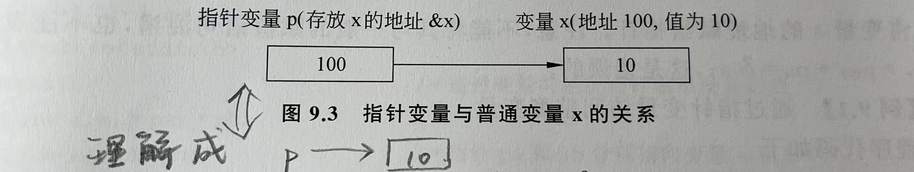

- &只能用于变量（基本数据类型、数组的元素、结构体变量或结构体成员），不能作用于数组名、常量或寄存器变量
  double r,a[20];
  register int k;
  》》错误 &a,&k,&(2*r)
- ->也是指针运算符，是利用结构体类型指针变量指向其结构体成员的时候使用

### 1.2指针变量的初始化、引用指针变量

#### 1.2.1 指针变量的初始化
```
法一：使用赋值语句进行指针初始化
int a,*pa;
pa=&a;

法二：在定义指针变量的同时进行初始化
int a,*pa=&a;

```

#### 1.2.2 引用指针变量（变量地址）
```
法一：用变量名直接引用
scanf("%d %d",&a,&b);//输入的时候直接把输入的值存放到a和b的地址中去了

法二：通过指向变量的指针间接引用
int a,b,*pa,*pb;
pa=&a;pb=&b;
scanf("%d %d",pa,pb);//输入的时候把值存放到a和b的地址中去了
printf("%d %d",*pa,*pb);

```


_________________

## 2指针与函数
在函数之间可以传递指针，函数利用指针传递参数有3中方式
- 指针作为函数的参数
- 指针作为函数的返回值
- 利用指向函数的指针传递

### 2.1指针作为函数的参数
在函数间传递变量的地址。变量的地址在调用函数时作为实参，被调用函数使用指针变量作为形参接收传递的地址

作用（ex2）：可以在函数内操作函数外定义的变量
```
ex1:
int plus(int *px,int *py)
{
    return (*px+*py);
}
int main()
{
    c=plus(&a,&b);//此时a和b都是int，传入的是两个int型的地址！
}
```
·
```
ex2:可以在函数之中操作函数外的变量
交换main函数中的两个变量的值
#include <stdio.h> 
#define A "hello" 
void swap(int *px,int *py)
{
    int temp=*px;
    *px=*py;
    *py=temp;
}
int main()
{
    int a,b;
    scanf("%d %d",&a,&b);
    printf("%d %d'\n'",a,b);
    swap(&a,&b);
    printf("%d %d",a,b);
}

```

> 指针变量所指单元的内容（指针的内容）：取指针所指向的单元的变量的值
> 指针变量的值（指针的值）：指针变量中存的某存储单元的地址

### 2.2函数返回指针
即函数的返回值为指针
```
数据类型 *函数名（参数列表）
{

}

```
数据类型后面的*--表示函数的返回值是一个指向该数据类型的指针！
ex:
int *max1(int *a,int *b)
{
    int *p;
    p=(*a>*b)?a:b;//取a和b之中的最大值的指针赋予p
    return p;//返回一个int类型的指针
}

### 2.3指向函数的指针（增加函数调用的方式）
定义一个函数之后，编译系统为每个函数确定了一个入口地址，当调用这个函数的时候，系统会从这个“入口地址”开始执行这个函数。存放函数的入口地址的指针就是一个指向函数的指针，简称**函数的指针**

`类型标识符(*指针变量名)()`

> C语言中,()的优先级比*高，因此”*指针变量名“必须使用括号，否则指针变量名首先与后面的（）结合，就是2.2的“返回值是指针的函数”
> > int (*pf)();//定义一个指向函数的指针，该函数的返回类型为int！
> > int *f();//定义一个返回值为指针的函数，该指针指向一个int型数据！

函数的指针也必须赋予初值，才能指向具体的函数。由于函数名代表了该函数的入口地址，所以可以
`函数指针名=函数名`

ex：
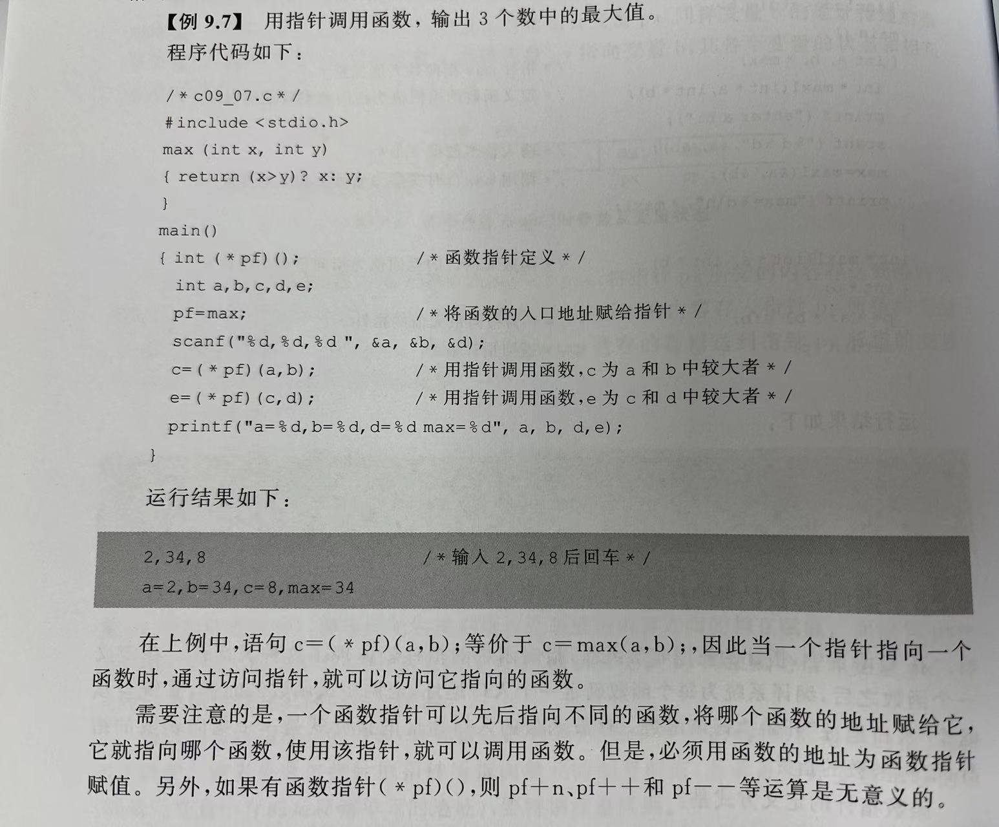

意义：可以定义一个函数指针，可以频繁改变它指向的函数，一直使用这个函数指针指向不同的函数完成函数调用！

________________

## 3.指针与数组
--[小心指针不指向任何地方（NULL），或指针指向超越了数组的边界（越界）]

### 3.1 通过指针引用一维数组元素
由于每个数组元素相当于一个变量，因此指针变量可以指向数组中的元素，也就是可以用 **“指针方式”** 访问数组中的元素。（因数组名代表了数组的首地址，所以可以通过指针找到地址）
即int a[5],*p;
  p=a;//此时p指针就指向了数组a的首地址了
具体对应关系如下
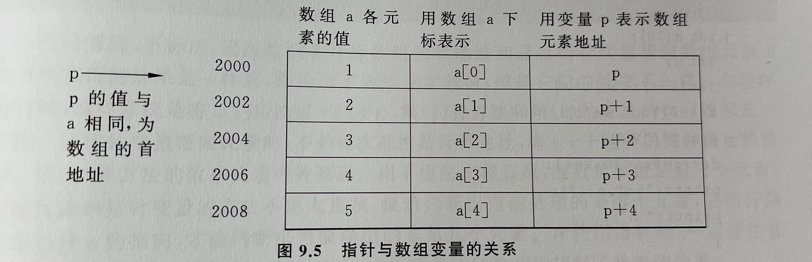

- 指针变量的类型必须得和它要指向的数组的类型一致
- 上图之中p+1是数组的下一个元素的地址（C语言规定，如果此时p已经指向了数组之中的一个元素）。所以p+1的具体地址和数组中元素的数据类型有关


已经有p=a;//此时a就可以表示成数组首地址啦
数组中的元素|指向的地址|具体的值
-|-|-|
a[i]|p+i=a+i|\*(p+i)=\*(a+i)
即&a[i]=p+i=a+i 且 a[i]=\*(p+i)=\*(a+i)

```
ex：通过指针访问数组元素
int a[10]={1,2,3,...};
int *p=a;
for(int j=0;j<10;j++) 
{
    printf("%d",*p);
    p++;
}

```

【补充：指针相关的计算优先级问题】
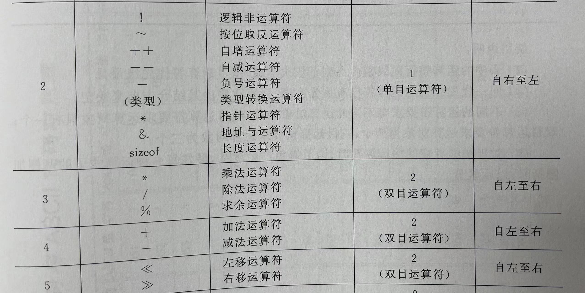
其中比较重要的就是++(自增操作符)的优先级>\*(指针操作符)的优先级，且运算顺序从右往左
》》\*++p等价于\*(p++),都是取下一个元素的值

### 3.2指针基本运算

#### 3.2.1指针的加减运算
p++和p--
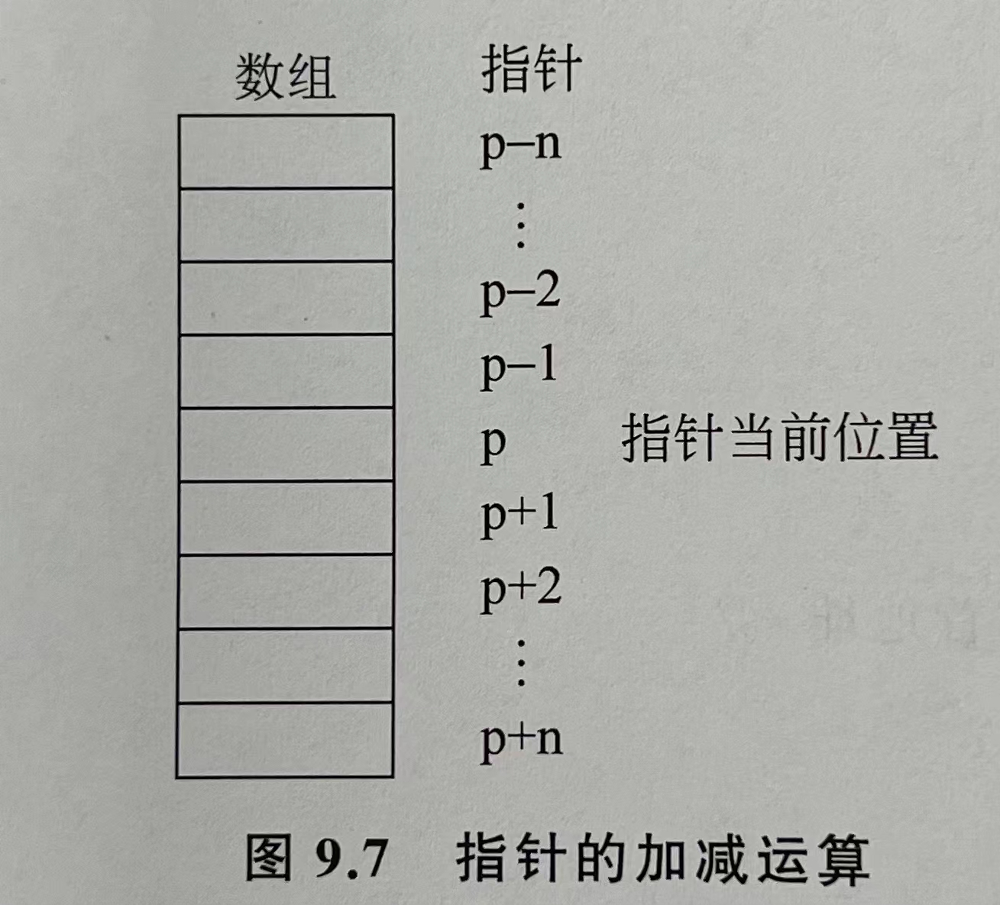

```
ex:把字符串str1复制到字符串str2之中（使用指针）
#include"stdio.h"
#include"string.h"
int main()
{
    char str1[80],str2[80],*p1,*p2;
    gets(str1);//可以包含空格的，接进来一个字符串
    p1=str1;
    p2=str2;
    while((*p2=*p1)!='\0')//【值得学习！！！整个左侧括号是一个赋值表达式】此时这个语句之中①完成了赋 值 ②完成了条件判断！
    {
        p1++;p2++;
    }
    printf(str2);

}


对以上循环体可以有两种改变
【法一】：
while(*p2=*p1)//规定，如果*p1=='\0',整个赋值表达式的值就是0，整个表达式就会被判断为false（和python中if之中放none一样，一定会被判断为false！）
{
    p1++;p2++
}

【法二】：
while(*p2++=*p1++)//循环体为空


```

·
```
其他例子：判断字符串长度
【巧！】
#include "stdio.h"
#include "string.h"
int main()
{
    char str[50],*p=str;
    gets(str);
    while(*p) p++;//利用循环判断，如果p指向'\0'，*p的值就是0，循环判断就是false，就会退出循环啦
    printf("%d",p-str);//同类型指针进行减法运算，求出串长！
}
```

#### 3.2.2 两个指针的关系运算

表达式|含义
-|-
p < q | 当p的地址小于q的地址时，表达式的值为1，反之为0
p==q| p和q指向相同元素的时候，表达式的值为1，反之为0
p==NULL|指针p为空的时候成立
tip：指向两个不同数组的指针进行比较，没有任何实际意义


【巧妙例子：双指针法！指向同一个数组的头尾指针，进行字符串逆序】
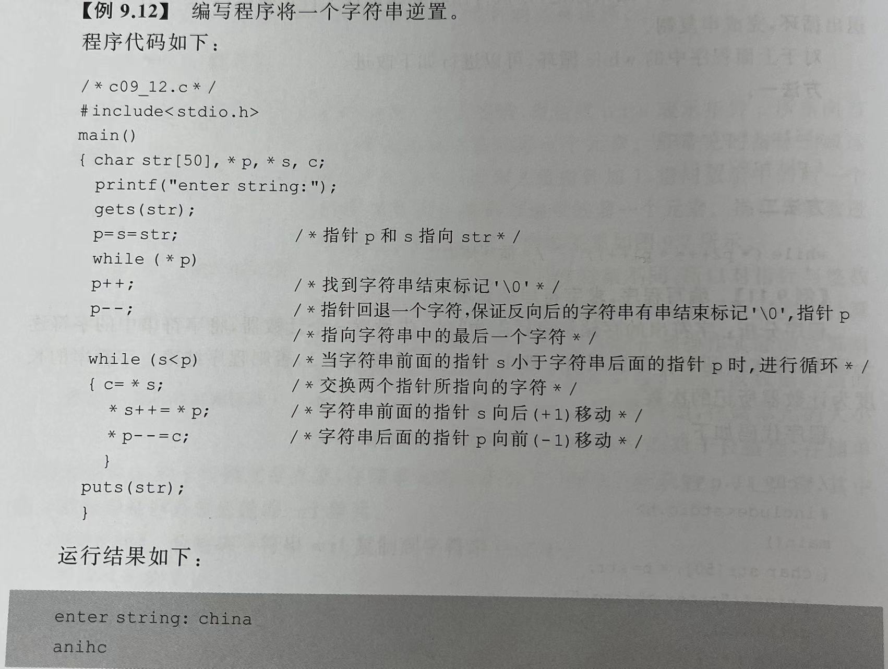
```
上面的循环的拆解写法，这样写更加容易理解呢！
while(s < p)
{
    char c;
    c=*s;
    *s=*p
    *p=c;
    s++;p++;
}
```

### 3.3通过指针引用二维数组元素

int a[4][2]的图例如下
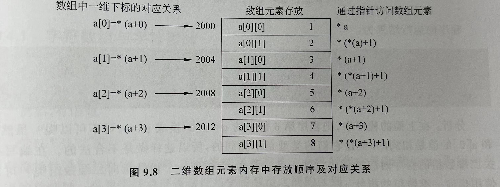

- 把二维数组理解为两个一维数组的嵌套
- a[0]之中还有一个b[2]的嵌套呢
> 从形式上看，a[i]可以看做是第i个元素。
> 若a是一个一维数组，那么a[i]就是数组a中第i个元素中的内容，这里a[i]是有物理地址的，占内存单元的
> 若a是一个二维数组，则a[i]是一个一维数组名，它本身并不占用内存单元，它**只是一个地址**，也就是这个二维数组第i+1行的首地址
> 所以a+1是一个地址，也就是a[1]。而\*(a+1)的含义也是a[1]。
> 这样a+i和\*(a+i)都是地址，和a[i]等价！！！
> 所以就会有a[0][1]=\*(\*(a+0)+1)

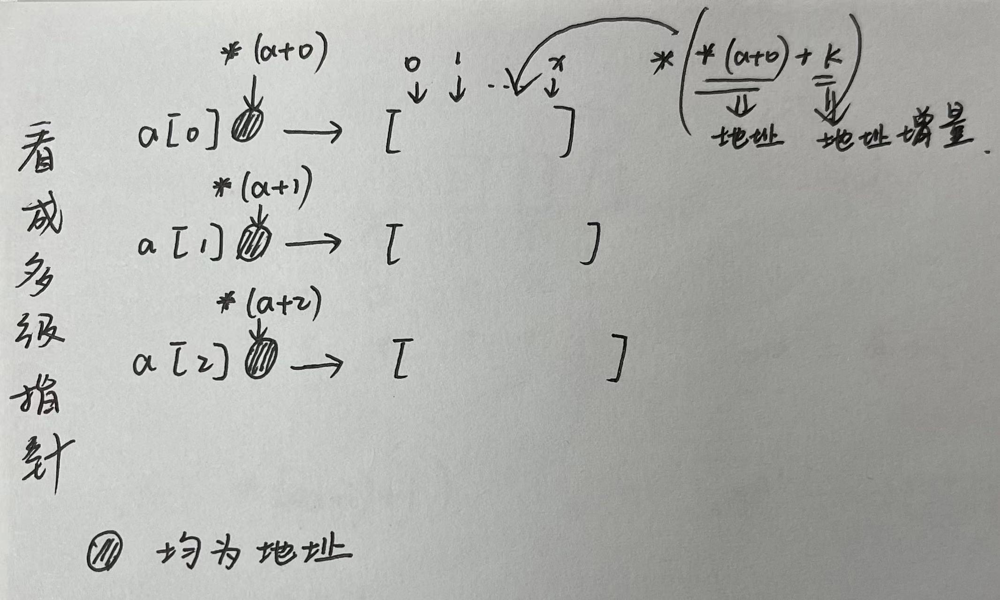
以下a[i]均表示为地址：
一维数组之中a[0]是&a[0],所以二维数组中a[0]=&a[0][0]，a[0]+1=&a[0][1]
以下a[i]表示值：
a[0][1]=\*(\*(a+0)+1)//其中\*(a+0)就是a[0]的首地址

```
ex：利用指针完成多维数组的输出
int main()
{
    int a[3][4]={{1,2,3,4},...}
    for (int *p=a[0];p<a[0]+12;p++)
        printf("%4d",*p);
}
```

tip：
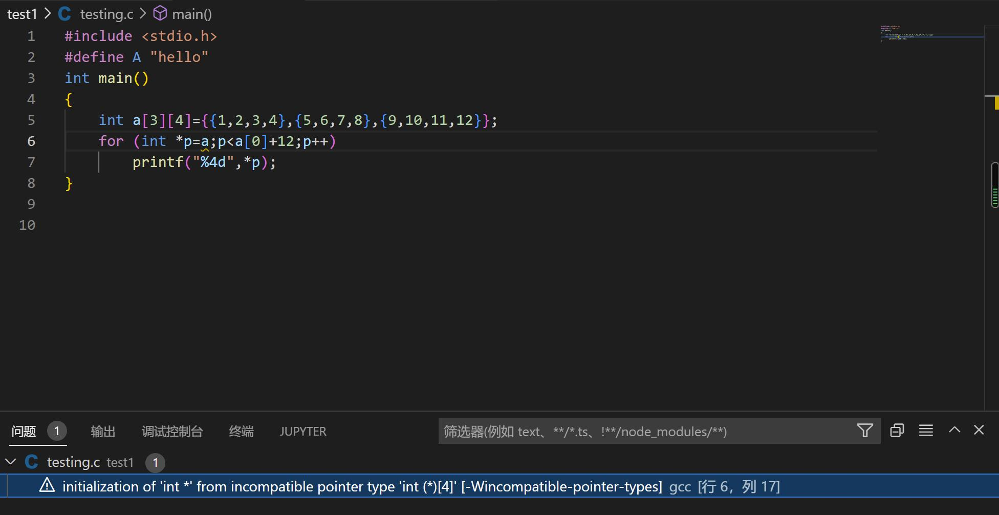
此时二维数组的首地址写成了a，就会有不兼容性的软报错，但仍然可以运行。
arr是二维数组名时，\*arr也是取arr的第一个元素，但是此时arr所指的元素是一个一维数组，所以，实际上arr所指元素是一维数组的首地址。就按arr[3][4]这个例子来看：3行4列数组arr可以理解为arr[0],arr[1],arr[2]这三个一维数组(数组含有4个元素)构成的二维数组， \*arr就是arr[0] ，而arr[0]就是第0行的首地址，也就是第一个数组的首地址。\*(arr+i)就是arr[i]，就是第i行的首地址。
- 本身没有错，只是不推荐这种表示方法呢！


________________

## 4.指针与字符串
字符指针 
`char *p='a'或char *p="this is a string";`
即字符指针可以指向一个字符，也可以指向一个字符串
存放字符串的时候，此时，字符指针存放的是一个字符串常量的首地址，即指向字符串的首地址

> tip：字符指针和字符数组之间的区别
> char *str="This is a string";
> char string[]="This is a string";
> str是一个变量，可以改变str使他指向不同的字符串（指针操作），**但不能改变str所指的字符串常量**
> string是一个数组，可以改变数组之中所保存的内容
> 如strcpy(str,string);-向str进行字符串复制不被允许！！！
> strcpy(string,str);-向string进行字符串复制，可以被允许！！
> strcat(string,str);-字符串连接，可以被允许！！！

补充：chapter7中数组的知识
现在再来看看，其实strcpy之中都是传入的两个数组的首地址
4. strcpy()(字符串复制函数)
- 把字符串2复制到字符数组1之中
  `strcpy(str1,str2);`
其中str2可以直接是一个字符串常量，也可以是一个已经定义过的数组名

### 4.1 常见的字符串操作
C语言中对字符串常量是按照字符数组处理的，在内存中**开辟了一个字符数组来存放字符串常量**
如char \*str="hello"，字符指针str只能指向一个字符变量（如'h','e'），不能同时指向多个字符数据（“he”）。
所以在用字符指针指向字符串的时，并不是字符串所有字符存放到了str之中，也不是把字符串赋给了*str，只是把字符串（以字符数组来存放这个字符串）的首地址赋给了字符指针


如下例子，在程序中并没有定义数组a，但是字符串在内存中是以字符数组的形式存放的
所有可以使用数组的元素访问方式来逐个访问数组中的元素！
```
字符数组
#include "stdio.h"
int main()
{   
    char *a="helloworld";
    int i;
    for(i=0;a[i]!='\0';i++)
        printf("%c",a[i]);
}

```
·
```
同理，整型数组。用指针指向这个数组的首地址，也可以通过下标访问的形式来呢。
其实，a[i]和p[i]都是一个含义的呀，
#include <stdio.h> 
#define A "hello" 
int main()
{
    int a[3]={1,2,3};
    int *p=a;
    printf("%d",p[1]);
}
所以有
a[i]=p[i]=*(a+i)=*(p+i)
```


**操作1：输出字符串**
```
char *str="hello";
printf("%s",str);
```
输出一个字符串的时候，系统先输出字符指针所指向的一个字符数据，然后自动让str+1，指向下一个字符，知道遇到字符串结束表示'\0'为止


**操作2：以指针传入函数**
```
void strcpy(char *str1, char *str2)
{
    while(*str2++=*str1++);//空循环喽
}

调用
strcpy(str1,str2);
此时直接传入函数的实参为一维数组名，即该数组的首地址。
接下来在函数定义之中只能以指针形式进行操作
```

对比：
定义 void del_string(char str[]){。。。}
调用 del_string(str1,str2);
此时直接传入函数的形参之中为一维数组名，即该数组首地址。
但在函数定义之中由于形参接收的是一个char类型的数组，所以可以以数组的操作进行

tip：最好在传入指针之后再创建一个新指针，指向传入进来的指针
     因指针和外界相通，避免对外界产生副作用


另外一个比较好的例子
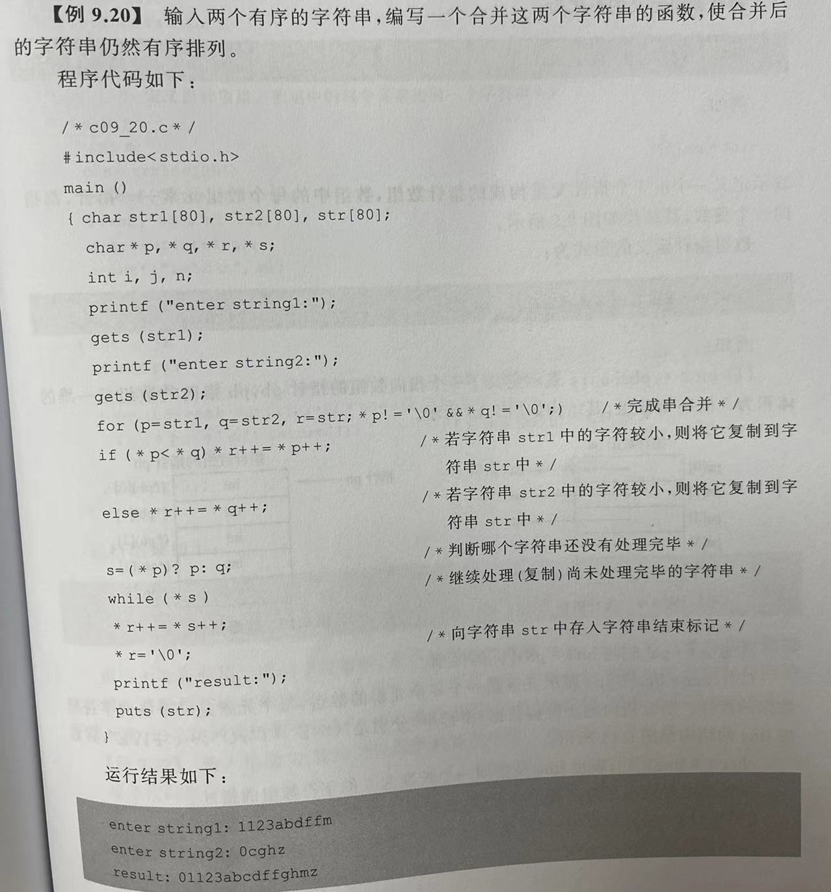

把p和q两个已知字符串每个字符进行比较，把有序的排列放到r之中
这个例子也用到了条件判断的时候'\0'会判断成false呢！
最后一步向字符串str追踪存入字符串标记符号也是必须的，因为【\*r=str是一个字符串常量】 ，和【字符串数组也是有区别的（不需要结束符'\0'）】
__________________

## 5.指针数组、数组指针及应用

**5.1指针数组--每个元素都是指针**
定义了许多指针（构成数组），一个数组中每个元素均为指针类型，即由指针变量构成的数组，这种数组成为指针数组
`类型 *数组名[常量表达式]`
ex: int *pa[5];
定义了一个由5个指针变量构成的指针数组，数组中每个数组元素-指针，都指向一个整数
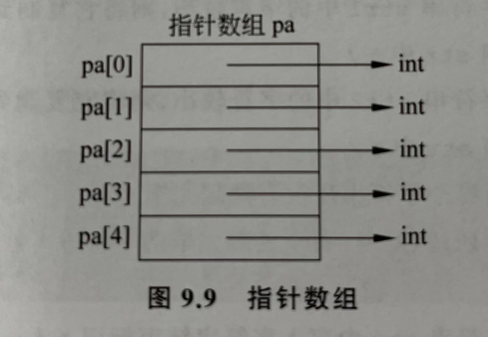


**5.2数组指针--指向数组的指针**
定义了一个指针，这个指针指向的是一个数组
`类型（*数组名）[常量表达式]`
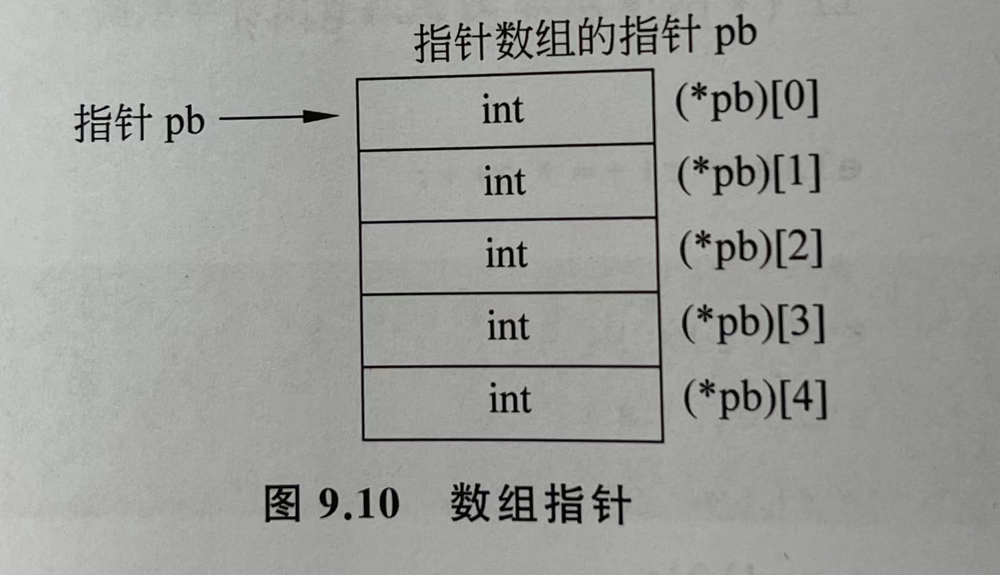
- 每个元素的访问 (\*pb)[i] //一定要加括号呢，\*操作符的优先级很低！

同理
char *line[5];//line是一个5个元素的数组，每个元素指向字符型数据（可以是字符或字符串）的指针
char (*line)[5];//line指向一个长度为5的字符数组的指针

**使用指针数组的优点：（相比较没有使用二维的字符数组**
**① 指针数组中【每个元素所指的字符串不必限制相同的字符长度】---【更大的灵活性！】**
**② 效率更高**
```


#include "stdio.h"

char * weekday[8]={"monday","tuesday","wednesday","thursday","friday","saturday","sunday",NULL};

int main()
{
    char string[20];
    scanf("%s",string);
    printf("%d",which(string));
}
int which(char ch[])
{
    int j;
    //发现问题，如果在for循环进行初始化的时候有多个变量，那么就不能直接创建+赋值了！
    char *p;//进行一个一个字符判断的
    for (int i=1;weekday[i]!=NULL;i++)
    {
        //C语言中两个字符串常量不能直接相等比较，只能一个一个字符进行判断！
        for(p=weekday[i], j=0;*p==ch[j];j++,p++)
        if(*p=='\0') return i;
    }
}
```
·
**使用数组指针的优点**
- 可以把多维数组进行“降维”，一次性这个指针指向一个长度为x的数组。
```
#include "stdio.h"
int main()
{
    int a[30][5];
    double b[30];
    int (*pa)[5];//此时只定义了一个指针哦！
    int i,j,sum;
    double *p;//【不用这个指针也是可以的，直接用下标访问呢！更加直观！！！】
    pa=a;p=b;//指针的赋值
    for(i=0;i<30;i++)
        for(j=0;j<5;j++)
            scanf("%d",*(pa+i)+j);
    //太巧妙啦！二维数组的指针访问方式，*(pa+i)是第几个“一维”数组，j是这个一维数组中第几个
    for(i=0;i<30;i++,p++)
    {
        for(j=0,sum=0;j<5;j++) 
            sum+=*(*(pa+i)+j);
        *p=(double)(sum/5);
    }
    for(i=0,p=b;i<30;i++,p++)
        printf("lf",*p);

}
```


**5.3 main函数的参数--实现main函数和操作系统的通信**

```
int main(int argc,char *argv[])
{
    ...
}
其中argc表示命令行参数个数（包括运行文件名在内）
    argv表示命令行参数的指针数组
```

在操作系统下运行C程序时，可以以命令行参数形式，向main函数传递参数
命令行参数的一般形式是：
`运行文件名 参数1 参数2...参数n`
其中,
argc表示命令行参数个数（包括运行文件名在内）
argv表示指向命令行参数的指针数组,argv[0]是运行文件名,argv[1]是命令函参数1
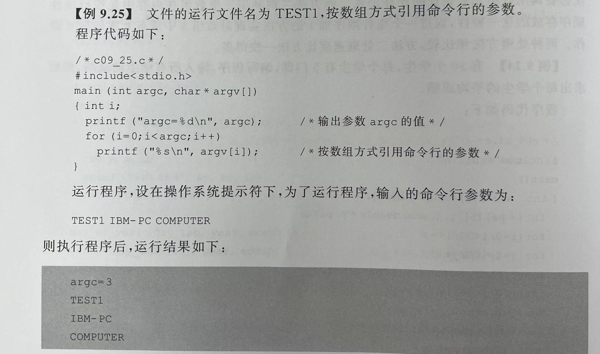

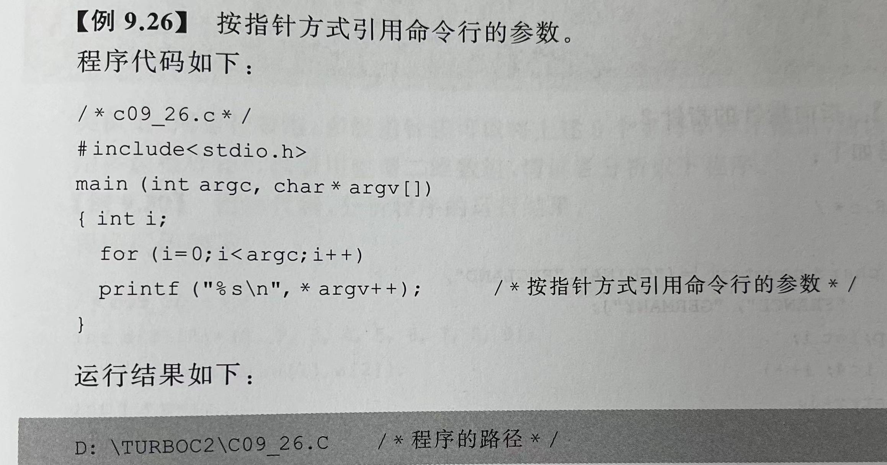

_________________

## 6.多重指针

当指针变量p中存放另一个指针q的地址的时候，则称p为**指针型指针**，也称**多级指针**
ex:
char \*\*p;等价于char\*(\*p);

ex:
int a,*pointer,**p;
pointer=&a;
p=&pointer;

```
ex:使用二级指针引用字符串
#include "stdio.h"
int main()
{
    char *pc[]={"Beijing","Shanghai"};
    char **p;
    int i;
    for(i=0;i<5;i++)
    {
        p=pc+i;//p指向不同的指针，pc是这个指针数组的首地址（第一个指针所在地址）
        printf("%s\n",*p);
    }
}
```

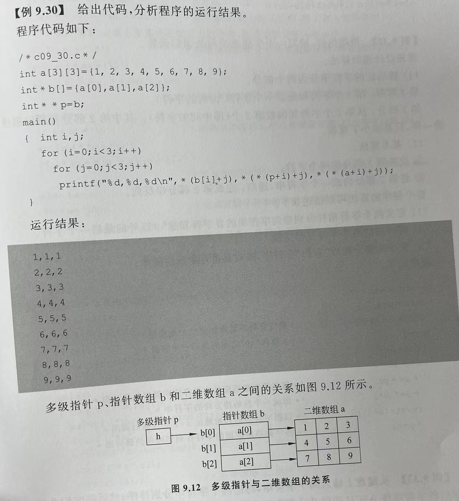

tip:
“字符串反向的递归函数”--第一个字符和最后一个（除了'\0'的字符的）进行置换，以此类推
                    --最后要在新字符串的最后加一个'\0'!

