# chapter11结构体类型与链表操作
结构体类型不同于数组（由若干个数据类型相同的元素组成），它是由若干个数据类型不同的数据项组合而成，并由用户根据需要自己定义的一种构造数据类型

## 1.结构体的概念和定义
DEF：结构体是一种构造数据类型，它是由若干个**相关的、类型不同的数据项**组合成一个整体而构成的一种数据结构（便于描述对象的所有属性或特征，且容易对某个信息项进行引用）
```
struct 结构体名
{
    成员列表
};
```
- 成员列表是结构体类型中各数据项成员，通常由一些基本数据类型的变量所组成，有时也包含一些复杂的数据类型的变量（可以嵌套struct呢，但不能嵌套本结构体类型的变量呢）。
- 注意要以“;”结束！
- 结构体类型中所含成员项的类型、数量和大小必须是确定的，即各个成员项都要进行**类型说明**，并**指明数据长度**，不能随机改变大小！
- 结构体成员名可以与程序中其他的变量名相同（如struct之中定义了year，main（）函数之中仍然可以定义year）
```
struct employee
{
    char name[20];
    int num;
    char sex;
    char telephone[40];
};

struct date
{
    int year;
    int month;
    int day;
    struct employee ouou;//结构体变量，可以理解为struct emplyee这整个都是他的类型名（自定义的结构体呢）
};

```

## 2.结构体变量的定义和初始化

### 2.1定义
一个结构体类型不能直接用来存放数据，只是设定了一种数据类型（和int地位等价的呢），只是【相当于一个模型，并不占用内存空间】。只有结构体定义了变量，这个变量才会占据一定的内存空间，才可以用来存放数据和引用
```
【法一】：先声明结构体类型，再定义结构体变量
struct emplyee em1,em2,em3;
前面已经定义了结构体类型struct emplyee（上面定义变量的时候先声明了这个结构体类型）

【法二】：在定义结构体类型的时候同时定义结构体变量
struct date
{
    float x;
    float y;
}birthday;
```
- 对结构体变量分配空间的时候，按照结构体中成员的**数据类型和在结构体中出现的先后次序**来分配空间的
  

### 2.2结构体变量的初始化
```
【法一】：定义时初始化

结构体类型 结构体变量名 = {初值表};

struct employee em1={"Li Ning",2002,'M'};
按照顺序逐个赋值
```
·
```
【法二】：结构体变量的同类型赋值
struct employee em1=em2;

```
·
```
【法三】：分别对每个结构体中的成员进行单独赋值

em1.name="Ou Ou";
```

## 3.结构体变量的引用
原则一：不能将一个结构体变量作为整体进行引用，只能对结构体变量中的成员分别进行引用。
`结构体变量名.成员名`
emplyee1.num = 020010;

原则二：如果一个结构体类型中还包含另一种类型的结构体变量，那么只能对最底层的成员进行引用，引用的时候还需要再加一个“.”成员运算符。【只能对结构体变量中最底层的成员进行赋值、存取及运算，不能对结构体中的结构体进行整体引用】
`结构体变量名.内层结构体类型名.成员名`
emplyee1.birthday.year

原则三：可以引用结构体变量成员的地址，也可以引用结构体变量的地址。
        结构体变量的地址主要用于作为函数的参数，以传递结构体变量的值。
ex1:引用结构体变量成员的地址
scanf("%d",&emplyee1.num);
ex2：引用结构体变量的地址
printf("%o",&emplyee1);


## 4.结构体数组

### 4.1定义
DEF：【由同一种结构体类型的变量组成的数组】就称为该类型的结构体数组

```
struct emplyee
{
    char name[20];
    int num;
    char sex;
};
struct employee groups[3];

此数组中有三个元素，都是该结构体类型的变量。和一般数组一样，在内存中都是连续存放的
```

### 4.2初始化
`一般形式：struct 结构体名 数组名[大小]={初值列表};`
```
struct employee groups[2]={
    {"Li Ning",010101,'M'},
    {"Wang Lin",010102,'M'}
};
```
`当然，也可以对结构体数组中的每个元素赋初值`
groups[1].age=30;//第一个结构体变量的age这个变量被赋予成30

### 4.3应用

**核心想法：存储多个相同类型的数据（同一个事物的多种属性）**
ex1：存储n个学生的高等数学、大学英语、大学物理的成绩
ex2：候选人得票情况
```
#include"stdio.h"
#include"string.h"
struct person
{
    char name[20];
    int count;
};    
struct person leader[4]={{"Li",0},{"Wang",0},{"Ma",0},{"Zhu",0}};
int main()
{
    int i,j;
    char vote_name[20];
    for(i=1;i<=3;i++)
    {
        scanf("%s",vote_name);
        for(j=0;j<4;j++)
            if(strcmp(vote_name,leader[j].name)==0)
                leader[j].count++;
    }
    for(i=0;i<4;i++)
        printf("%5s:%d\n",leader[i].name,leader[i].count);
}
```

## 5.结构体指针

### 5.1指向【结构体变量】的指针
DEF：指向结构体类型数据的指针
ex:
struct student \*p;
struct student stu1;
p=&stu1;
这样就可以使用结构体变量或结构体指针变量来访问结构体变量的成员了
(\*p).num;(\*p).name

> 在C语言中，引用结构体成员的形式有三种
> ①结构变量名.成员名
>   如 tester.name;
> ②利用结构体指针变量和结构体成员运算符“.”引用成员
>   (\*指针变量名).成员名
> ③利用**结构体指针变量**和指向结构体成员运算符->来引用成员
>   p->name;
> 【注意：这种方法只有在p是结构体指针的时候才会适用的呢！】

其中，"->"和“.”的优先级最高
如 ++p->a; 这种情况下先执行p->a，再执行++运算
如 p->a++; 这种情况下先执行p->a,为x[0],再执行x[0]++的操作呢


### 5.2指向【结构体数组】的指针
结构体数组的指针就是该结构体数组所占据的内存空间的起始地址。把一个结构体数组的起始地址赋给一个结构体类型的指针变量的时候，就称该指针变量为指向结构体数组的指针变量
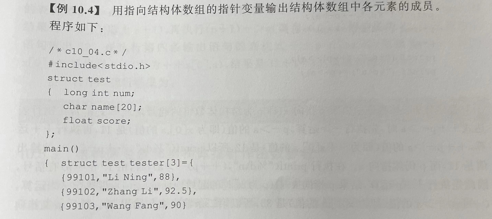
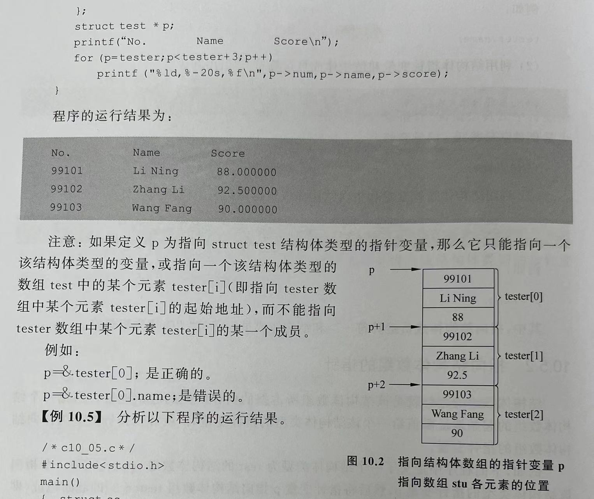
> 注意！如果p是指向struct test结构体类型的指针变量的话，那么他只能指向一个结构体类型的变量。
> 而不能指向某一个结构体变量的某一个成员

【习惯上，在定义了结构体指针之后，在C和C++之中都使用“->”来进行成员访问呢！】


### 5.3 结构体变量和结构体指针作函数参数
结构体变量和结构体指针和一般的参数一样，可以把一个结构体变量的值或一个结构体数组的值传递给另一个函数

```
struct stu
{
    char name[20];
    float score;
};
void sort(struct stu *p,int n)
{
    int i,j,k;
    struct stu temp;
    for(i=0;i<n;i++)//采用冒泡排序法，每两个之间比较，把小的放到前面来哦
    {
        k=i;
        for(j=i+1;j<n)
        {
            if(strcmp(p[k].name,p[j].name)>0)
            //此时p[i]不再是一个指针，而是一个结构体变量，只能用"."来访问喽
                k=j;
        }
        temp=p[k];
        p[k]=p[i];
        p[i]=temp;
    }
}
```
上面这个函数的参数如果换成一个不限大小的struct stu类型的数组也是一样的，只不过使用指针的效率更高，在这种情况下也不那么抽象啦

_________________________

## 6.链表（一种数据结构）
warm up：
引用自身结构体：在一个结构体类型定义之中可以用指向本结构体类型的指针变量作为成员。这种结构体类型就称为引用自身的结构体

ex:
struct stu
{
    int num;
    float score;
    struct stu *next;//指向本结构体类型的指针变量
};

### 6.1 概述
【链表】
DEF：链表是一种常见的重要的数据结构，由若干相同类型的结构体（引用自身的结构体）变量组成，并用指针把一个个的结构体变量连接起来【可以动态地进行存储空间分配】
- 可以通过增加或减少一个环节，来加长或缩短链条的长度
- 单向链表、双向链表、循环链表

【头指针head】
DEF：存放链表的第一个元素的地址，即指向第一个元素

【结点】
DEF：链表中每一个元素称为“结点”，每个结点中包含两部分内容：第一部分-结点数据本身。第二部分-指向第一个节点的指针。
- 链表中最后一个结点称为链尾，链尾结点中指针的值为空（NULL），表示链表结束


补充：结构体数组和链表的区别
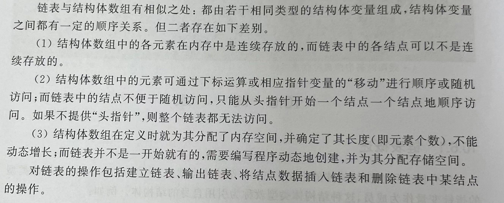

其中，【链表中各结点可以不是连续存放的】最为重要！

### 6.2 C库中链表操作所提供的函数
**需要包含头文件：#include<stdlib.h>**【必须使用，和C++有差异】

帮助在需要时，动态建立、开辟存储空间；在不需要时，删除链表结构中某一个结点，释放一个节点的存储空间。

提供了malloc()\calloc()\free()来动态地开辟和释放存储空间的函数

① malloc()函数-分配【一个】大小为size的连续空间，并返回指针
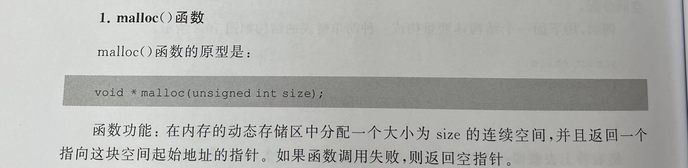
② calloc()函数- 分配【n个】大小为size的连续空间，并返回指针
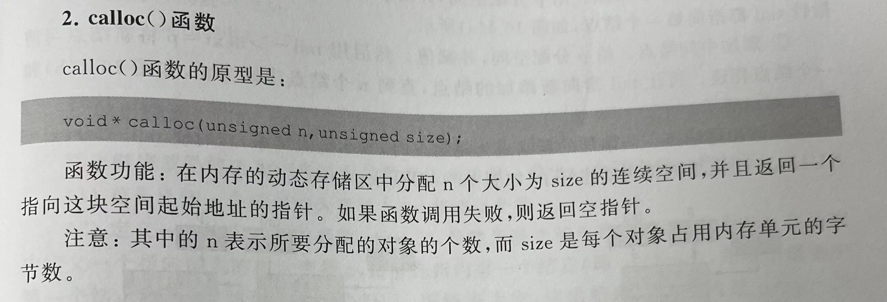
③ free()函数- 释放由p指向的内存区。【其中p必须是由malloc或calloc函数得到的指针！】
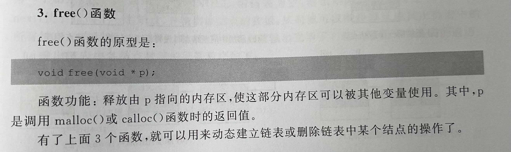

其中上面这三种函数之中，void只是原型函数，当定义了一个结构体类型的时候，可以把void换成这个结构体函数。
即(struct student*)malloc(sizeof(struct student));


### 6.3链表的操作

**1.建立链表**
一个一个地建立新结点和输入各结点数据，并建立起前后结点的关系

step1：建立一个链表节点的结构体类型，设链表的节点数为n
```
struct Node
{
    int num;
    char name[20];
    struct Node*next;
};
int n;
```

step2:定义一个建立链表的函数creat()，返回值为链表的头指针
且在函数中设置3个指针变量head（头指针，指向链表的头结点）\p（指向新建结点）\tail（指向当前链表的最后一个结点）
struct Node \*head,\*p,\*tail;

- 让head为空NULL
- 添加第一个结点。给p分配空间，并给p各个成员赋值。让头尾指针head和tail都指向第一个结点
- 添加中间结点。给p分配空间，并赋值。用tail->next=p将新结点与前一个结点相连。再让tail指向新添加的节点
- 添加尾结点。令tail->next=NULL;结束

过程如下图所示：
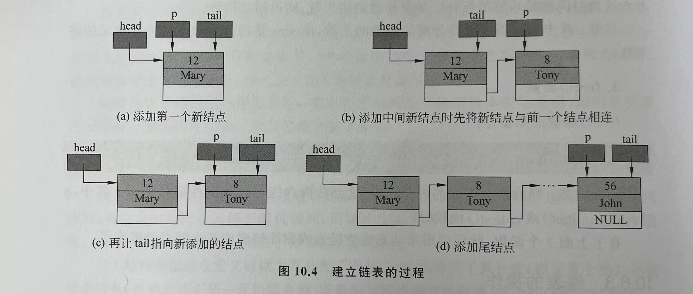

此过程的函数如下所示
```
#include<stdio.h>
#include"stdlib.h"
struct Node
{
    int num;
    char name[20];
    struct Node*next;
};
int n;

struct Node *creat()//返回一个指向Node结构体变量的指针（头指针head）
{
    struct Node *head,*p,*tail;//p是用来不断创建新结点的。tail是用来定位上一个节点和尾结点的
    head=NULL;
    n=0;
    //创建了第一个结点
    p=tail=(struct Node*)malloc(sizeof(struct Node));//分配一个大小为size的连续空间，返回指针地址
    scanf("%d,%s",&p->num,&p->name);//已经分配了p所指向的那一块空间的地址了
    //不断加入结点
    while(p->num!=0)//链表创建的结束符号是输入的num是0呢！
    {
        n++;
/*本例子中n用处不大（只用在判断单链表之中呢），但如果是创建一个大小为n的链表，就可以用这个来放到while判断中啦。*/
        if(n==1)//此时是第一个结点，让head指向第一个结点p
            head=p;
        else
            tail->next=p;//此时tail->next还没有东西呢，只不过两者指向了同一块空间
        tail=p;//让tail始终定位上一个节点tail呢
        p=(struct Node*)malloc(sizeof(struct Node));//现在tail->next才开始被放在了链表的后面呢
        scanf("%d,%s",&p->num,&p->name);
    }
    tail->next=NULL;
    return(head);
}

```

**2.输出链表**

把链表中各结点的数据依次输出。已知链表的头指针head和结点个数n
- 定义print()函数，参数为链表头指针，返回值为空。定义一个p=head，顺藤摸瓜访问所有结点（链表的遍历）

```
void print(stuct Node *head)
{
    struct Node *p;
    p=head;
    if(head!=NULL)//判断链表是不是空的
    {
        while(p!=NULL)
        {
            printf(...,p->name,p->num);
            p=p->next;
//此时链表中相邻两个节点不一定是连续存放，所以不可以使用p++(p加一个sizeof(struct Node))不一定是对的
        }
    }
}
```

**3.删除链表中某结点（此时需要考虑找不到要删除的这个节点）**
不是把某个结点从内存中删除，而是把它从链表中分离，撤销它与原来链表的连接关系，而不破坏剩下结点的连接顺序。
如果被删除的节点不再使用，一定要用free函数把它释放。

- 已知头指针head和结点个数n。定义删除函数del(),参数为链表的头指针和待删除节点（有这个节点的一些信息），返回值为删除之后的头指针。
- 函数中定义两个指向链表的指针变量p和pGuard，一个先指向头结点，另外一个指向遍历中上一个节点。
- 从头指针开始寻找待删除节点，删除后释放。


以下图示三种情况，后两种处理方法一样，第一种不同（故需要一个if函数多写一点呢！）
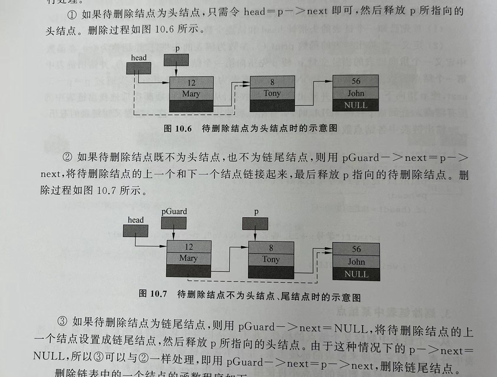

以下为代码实现：
```
struct Node *del(struct Node *head,int num)
{
    struct Node *p,*pGuard;
    if(head==NULL)//situation1【链表为空】
    {
        printf("链表为空");
        return(head);
    }
    p=head;
    while((p->num!=num)&&(p->next!=NULL))//因为while判断为正确的之后，p还会往下走一个节点
    {
        pGuard=p;
        p=p->next;
    }
    /*此时出来有两种情况：
    ① 根据特征找到了这个节点
    ② 遍历了所有结点都没有找到，最终p到了尾结点！
    */
    if(num==p->num) //situation2【找到了节点】
    {
        if(p==head) //situation2.1【节点在头结点】
            head=p->next;
        else        //situation2.2【节点不在头结点，包含了两种情况】    
            pGuard->next=p->next;
        n=n-1;//节点个数-1
    }
    else
        printf("没有找到节点");
    return (head);
}

```

**4.链表的插入（此时无需考虑没有这个地方让他插不进去）**
把一个结点插入到一个已有的链表之中

```
定义结构体
struct student
{
    int num;
    char name[20];
    struct student *next;
};
```

- 已知链表的头指针head，节点个数n，待插入的结点stud
- 定义一个插入链表的函数insert(),参数为链表的头指针和指向待插入结点的指针，返回值为插入后的链表的头指针，同理，定义pGuard指向插入位置的上一个结点
- 从头指针开始寻找待插入结点的位置，一共有四种情况，如下图所示：
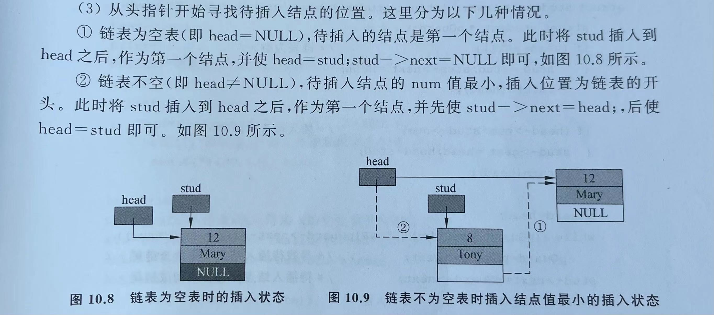
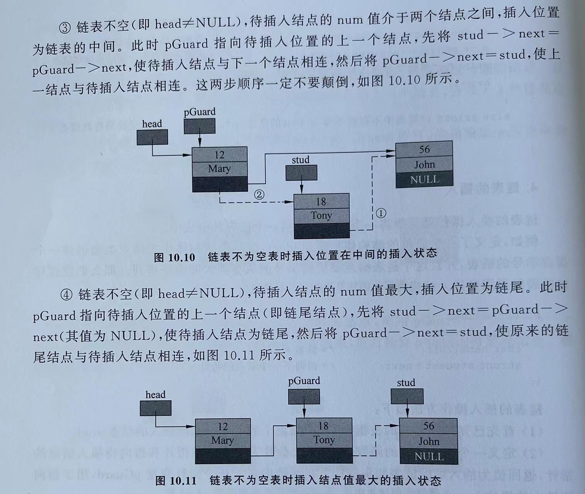
> 插入链表为空
> 插入为头结点
> 插入的节点不为头结点，同时也不为尾结点
> 插入为尾结点
> 【后两种情况操作方式相同】

```
传入的节点以指向这个节点的指针来寻找
本例子中“寻找位置”是 小的在前面，大的在后面
struct student *insert(struct student *head,struct student *stud)
{
    struct student *pGuard;
    if(head==NULL)//插入的链表为空的
    {
        head=stud;
        stud->next=NULL;
        return(head);
    }
    if(stud->num<head->num)//插入在链表头
    {
        stud->next=head;
        head=stud;
        return(head);
    }
    //以下是剩下的两种情况，相同的操作
    pGuard=head;
    while((pGuard->next!=NULL)&&(stud->num < pGuard->next->num))
        pGuard=pGuard->next;
    stud->next=pGuard->next;
    pGuard->next=stud;
    return(head);

}
```

**5.链表的综合操作**

只要有新节点的出现，都需要调用malloc函数来分配新空间呢！
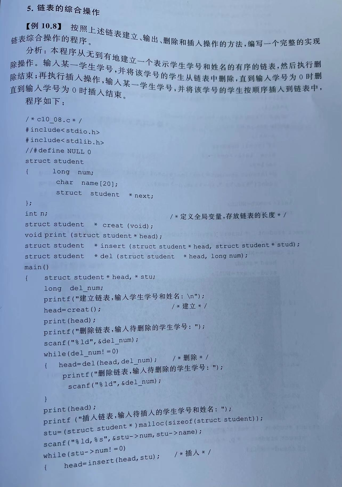
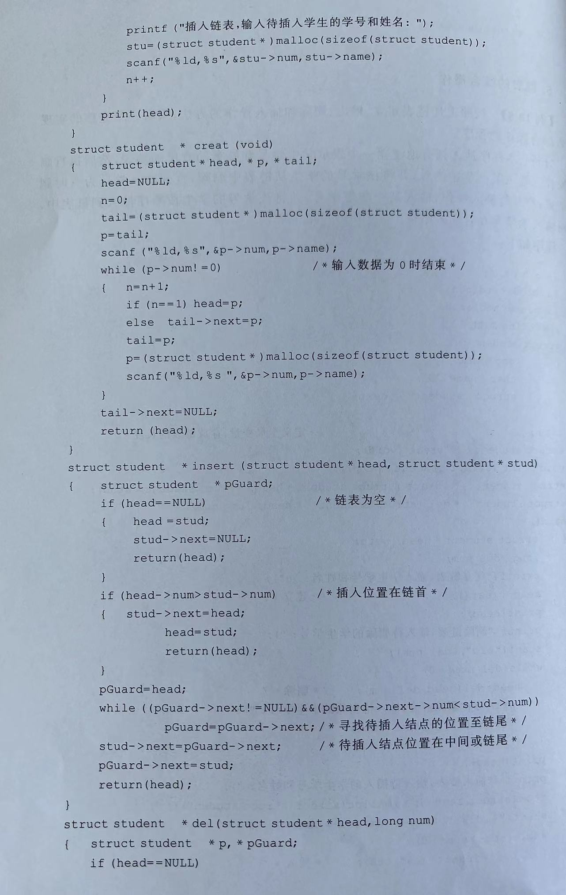
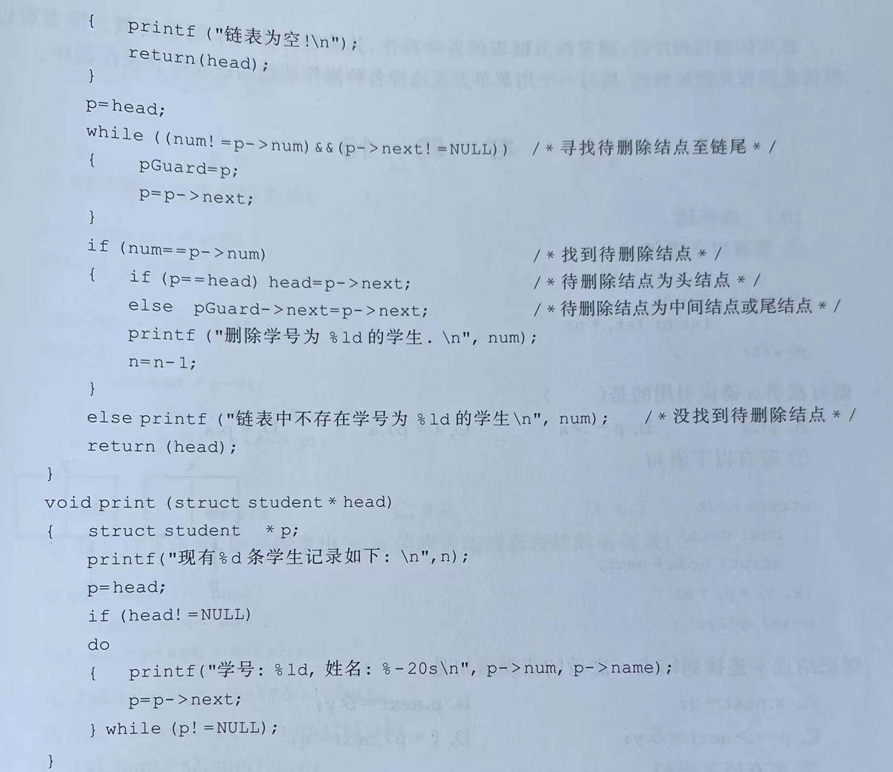
