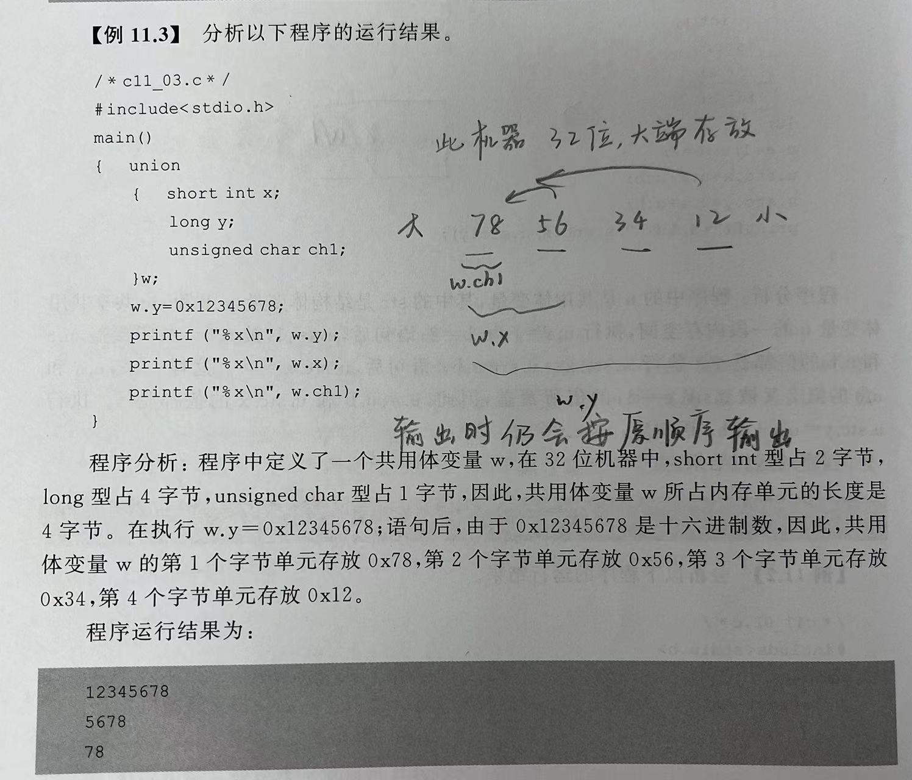

# chapter12 共用体与枚举类型

## 1.共用体（union）

### 1.1概念和定义
DEF：一种数据类型，让几种不同类型的变量存放到【同一段内存单元中】
```
【定义共用体类型】
union 共用体名
{
    成员列表;
};
```
ex:
union date
{
    int a;
    float b;
    char c;
};
- 此data共用体包含3个数据成员，a、b和c。
- 此共用体类型data可以把一个整形变量、一个实型变量和一个字符型变量【放在同一个地址开始】的内存单元中
- 这3个变量在内存中所占的字节数不同，**但它们都从同一地址开始存放**
- - **在引用时（赋值）使用覆盖技术，几个变量的值可以相互覆盖（若后面有其他变量的赋值，前面变量的赋值就失效了），在某一时刻只有最后一次赋值的那个成员变量的值起作用**


```
【定义共用体变量】
union 共用体名 变量列表;
```

> 补充：共用体变量和结构体变量的区别
> 结构体：每一个变量的每个成员分别占有自己的内存单元，结构体变量所占内存空间的长度是各成员所占内存长度之和。
> 共用体：各个成员共同占有同一段内存空间，**【共用体变量所占内存空间的长度是其成员中所占内存长度最长的那个成员的长度】**


### 1.2 共用体变量的引用

原则一：不能整体引用共用体变量，只能引用共用体变量中的成员【和结构体一样的捏，不能整体赋值】
ex:b2=b1;是错误的

原则二：可以定义共用体类型的指针变量，指向一个同类型的共用体变量x。同时可用->来引用其成员
```
union data
{
    int a;
    float f;
}x,*px;

px=&x;
px->a=100;
或(*px).a=100;
```

**共用体的特点**
- 共用体类型中可以包含几个不同类型的成员，这几个不同类型的成员可以存放在同一个内存段里。【但某一时刻该内存段中只能存放其中一种成员，而不是同时存放几个成员】
- 共用体变量中起作用的成员是最后一次赋值存放的那个成员。【先前赋过值的成员被新赋值的成员所覆盖而失去作用！】
如
b1.a=100;
b1.c='A';
b1.f=3.14;
最后存放的只有f，a和c尽管被赋值过，但已经被覆盖了

- 如上例子，共用体变量的地址和它的各个成员的地址相同！
  即&a=&a.i=&a.f
- 不能在定义共用体的时候对它进行初始化
> **不能把共用体变量作为函数参数，函数的返回值也不能带回共用体变量。**【和结构体是不一样的！】
> 但可以【使用指向共用体变量的指针作为函数参数】！


**理解内存覆盖（内含结构体）**
ex1：


```
上面的改版。
最后一个输出结果为
4 4 4 4
#include"stdio.h"
int main()
{
    union emp
    {
        struct{
            int y;
            int x;
        }stc;
        int a;
        int b;
    }u;
    u.a=1;u.b=2;
    printf("a=%d b=%d",u.a,u.b);
    u.stc.x=u.a+u.b;
    printf("a=%d b=%d x=%d",u.a,u.b,u.stc.x);
    u.stc.y=u.a+u.b;
    printf("a=%d b=%d x=%d y=%d",u.a,u.b,u.stc.x,u.stc.y);
}

所以这样就很清楚的说明了，a、b和结构体变量先定义的那个共用同一块内存，后定义的那个再开辟一块地址
```

ex2：存放方式



### 1.3共用体编程举例

- 在不同条件下输出不同数据（也仍可替换成别的数据结构，但共用体占据空间比较小！）
  


__________________

## 2.枚举类型
某些数据的取值都被限定在几个可能值的范围内（口袋中红、黄、蓝，一个星期有7天）

### 2.1枚举类型的概念及其变量定义
DEF：枚举类型的数据是把变量的所有取值一一列举出来，变量的值只限于列举出来的值的范围内。
【若一个变量只有几种可能的值，就可以定义该变量为枚举类型的变量了】

`枚举类型定义：enum 枚举类型名 {枚举元素列表};`
·
`枚举变量定义：enum 枚举类型名 变量名;`


ex:
enum weekday{sun,mon,tue,wed,thu,fir,sat};
enum weekday workday,weekend;

其中，sum、mon等称为枚举元素或枚举常量，是右用户自己定义的标识符

### 2.2枚举类型数据的使用
- C语言编译中，对枚举元素按整常量处理。不是变量，不能在定义之外对它们赋值
  如sum=0;mon=1;是错的
- 枚举元素作为常量，在C语言编译的时候按照定义的顺序使他们的值为0，1，2，3...
  如上面的weekday类型，sun=0,mon=1,tue=2...sat=6
- 【**也可以在定义时，改变枚举变量的值（没有改变的，一样递增）**】
  enum weekday{sum=7,mon=1,tue,wed,thu,fir,sat}workday;
  从mon之后，各元素的值顺序+1
- 可对枚举变量赋值，但取值范围限定在枚举列表中的各值.**【但一个整数不能直接赋值给一个枚举变量！】**
  workday=mon;
  printf("%d",workday);//输出1
  但workday=1;是错误哒！

### 2.3 很好的例子
```
一个口袋中有红黄蓝3个球，依次从口袋中拿出所有球，编写程序，输出所有的拿法
```
·
```
#include"stdio.h"
enum color{red=1,yellow,blue};
void print(enum color ball)
{
    switch(ball)
    {
        case red:printf("red");break;
        case yellow:printf("yellow");break;
        case blue:printf("blue");break;
    }
}
int main()
{
    enum color i,j,k;
    for(i=red;i<=blue;i=(enum color)(i+1))
    {
        for(j=red;j<=blue;j=(enum color)(j+1))
        {
            for(k=red;k<=blue;k=(enum color)(k+1))
            {
                if(i!=k&&k!=j&&j!=i)
                {
                    print(i);printf("  ");print(j);printf("  ");print(k);
                    printf("\n");
                }
            }
        }
    }
}

注意：
······不是每一个for循环之后都要加花括号{}的！如果只有一个语句就最好别加，会增加程序可读性的呢！
······本例子中的(enum color)(i+1)可以简化成i++，也可以是i=i+1
>>>>>>所以枚举类型是【可以在使用的时候和一切整形一样使用的】，【只是不能像整形变量一样被赋值！】

```

____________

## 3.用typedef定义类型
C语言中，除了可以直接使用C提供的标准类型名（int、float、long等）和用户自己声明的结构体、共用体个枚举类型外，还可以使用typedef声明新的类型名来代替原有的类型名

`typedef 类型名 标识符;`

ex:
typedef int A[10];
声明了一个新的整形数组类型名A，该类型数组包含的元素个数为10》》含10个int类型的数组类型 A

- 类型名 是【已有定义】的类型标识符，而不是定义一种新的数据类型
- 标识符 为用户自己定义的用来替代原有类型名的类型标识符

```
ex:

typedef int INTEGER;
int i;===INTEGER i;

typedef int NUM[10];//声明NUM为包含10个元素的整形数组类型
NUM a;//定义a为包含10个元素的整形数组

typedef struct node{
  char data[20];
  struct node *next;
}STYPE;
STYPEnodel,*p;//定义了一个具有node结构体类型的变量和一个指向这个结构体变量的指针p
```

- 用typedef声明的类型名通常用大写字母表示，以便于系统提供的标准类型名区别开来
- typedef只是对原有的类型起个新名字，没有生成新的数据类型
- typedef和#define有相似之处，但两者的作用不同
  #define是在系统预编译的时候处理，他只能做简单的字符串替换
  typedef是在系统预编译的时候处理的，他并不是简单的字符串替换！！！（而是一种类型名的替换）

```
typedef的经典用法，用来构建没有提供多维数组的数据类型，如char（结构体应该也可以捏）
》》创造了大小为n，每个元素都是字符串的一个数组呢！


#include "stdio.h"
typedef char ch[20];
int main()
{
    ch ch1[3];//有3个可以存放20个字符的字符串数组
    for(int i=0;i<3;i++)
    {
        scanf("%s",&ch1[i]);
    }
    for(int i=0;i<3;i++)
    {
        printf("%s",ch1[i]);
    }
}

```


