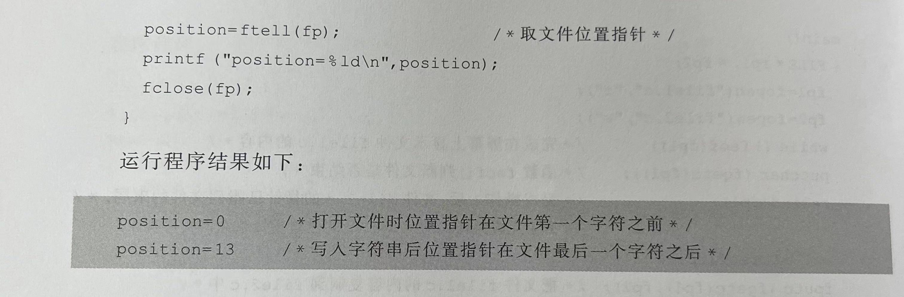

# chapter13 文件

**因不很常用，多数信息以图片呈现，现用现学就可以啦**

## 1. 文件的概念
DEF：文件-就是一个存储在外部介质上的数据集合，一批数据以文件的形式存放在外部介质上。
- 操作系统就是以【文件】为单位对数据进行管理的
- C语言中，文件的含义比较广泛，不仅包含上述磁盘文件，还包括一切能进行输入和输出的终端设备（被看作是设备文件，如键盘-标准输入文件，显示器-标准输出文件）
- C语言把文件看作是一个字符的序列，即由一个字符的数据顺序组成

#### part1:数据的组织形式分类
**文本文件（字节流）**
ASCII码文件，即TEXT文件。在此类文件之中，数据采用的ASCII码的形式进行存储的，保存在内存中的所有数据在存入文件的时候都要先转换为等价的字符形式！
在此类文件中，每个字符占用1个字节，每个字节中存放相应字符的ASCII码。
- 好处-便于字符处理，便于字符输出
- 坏处-占用的空间比较多，要花费转换的时间

**二进制文件（二进制流）**
每一个字节都是真正的二进制数，也就是把内存中的存储形式原样存放在磁盘上。
- 好处：可以节省存储空间
- 不足：不能直接输出字符形式
一般中间数据结果常用二进制文件保存

C语言中，对文件的存取是以字符为单位的。输入输出的数据流的开始和结束仅仅受到程序控制而不受物理符号的控制（换行符、回车符均不作为输入输出结束的标志！）》》**【流式文件】**

C语言引入了**数据流**，数据流是对数据输入输出行为的一种抽象。只要建立了输入输出流，编程这在应用程序时不需要关心输入输出设备或者是任何磁盘文件的具体细节差异。程序的输入只需要从输入数据流中读入，输出数据只需要从输出流中写出即可。【程序完全与具体的硬件资源脱离了关系--方便移植】

#### part2：文件的处理方法分类

**缓冲文件系统（高级磁盘输入输出系统）**：
调用文件处理函数时，系统会自动在用户内存区中为每一个正在使用的文件划出一片存储单元，即开辟一个缓冲区。
因磁盘读写速度比内存的处理速度要慢很多
从磁盘的数据扇区---缓冲区---程序的变量
- 下次再读，看缓冲区有没有数据，有-直接读，没有-磁盘中再读一个数据扇区---缓冲区---程序的变量
- 下次再写：写到缓冲区中，写满了才会一起送到磁盘文件上去

**非缓冲**
在1983年后，ANSI C标准中取消了非缓冲文件系统，文本文件、二进制文件统一采用缓冲文件系统处理

【文件操作的3个步骤】

_____________

## 2.文件的处理
由C语言库函数实现，文件操作函数也属于C语言标准输入输出库中的函数，即#include"stdio.h"

### 2.1文件类型的定义
对每一个正在使用的文件都要说明一个FILE类型的结构变量，该结构变量用于存放文件的有关信息（文件名、文件状态）
文件结构不需要用户自己定义，事先由系统定义，包含在stdio.h文件之中

上图中的FILE为所定义的文件结构类型的类型名。文件结构在打开文件的时候由操作系统自动建立。

但C程序中，凡是要对已打开文件进行操作，都需要在程序中说明指向文件结构的指针！，即定义FILE类型的指针变量！
`FILE *文件型指针名`
ex: FILE \*p;
若需要同时处理多个文件，则需要说明多个指向FILE型结构的指针变量，分别指向不同的文件

### 2.2 打开文件

### 2.3关闭文件

______________

## 3.文件的读写

### 3.1 fputc()函数 和 fgetc()函数

### 3.2 fgets()函数 和 fputs()函数

### 3.3 fprintf()函数 和 fscanf()函数

### 3.4 fread()函数 和 fwrite()函数

____________

## 4.文件的定位操作

_____________

## 5.文件操作的状态和出错检测

