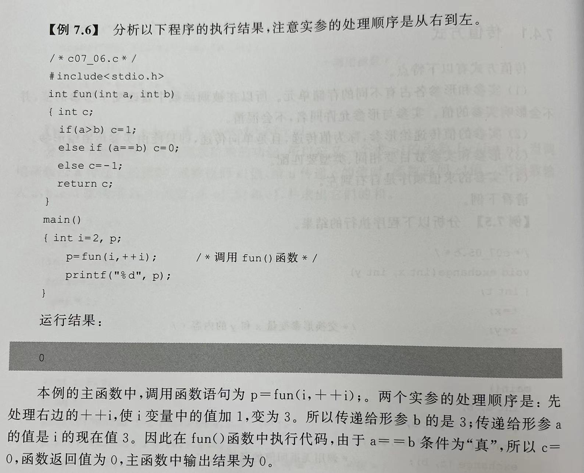
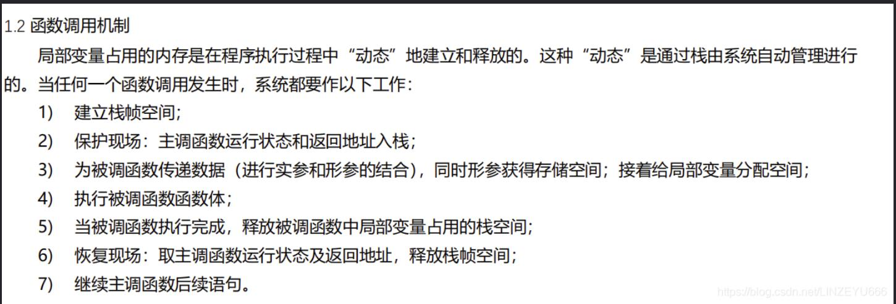
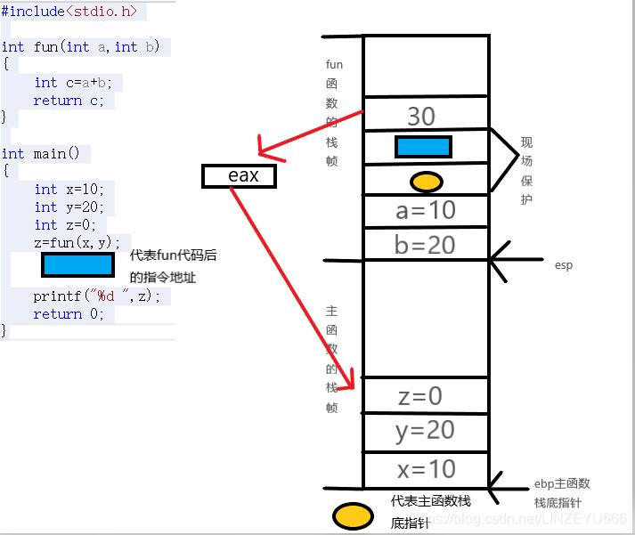

# chapter8 函数
warm up:对某种操作或者运算多次使用，**函数**可以完成只让重复使用的程序段只写一次
- C语言的基本组成单位是函数，可以把复杂的功能划分为若干子功能模块
- 使每个模块都成为结构清晰、功能单一、接口简单、容易理解的小程序。

## 1.函数的概念
### 1.1程序中常见的函数们
main()函数是程序执行的开始点，子函数中的代码只有被调用时才会执行
子函数可以互相调用，但子函数不能调用main()函数；一般由main()函数调用其他子函数
> C函数：标准库函数+用户自定义函数

#### 1.1.1 标准库函数
使用库函数的时候，要用预编译命令#include，将有关的头文件包含到用户的源程序文件中。
`头文件:作为一种包含功能函数、数据接口声明的载体文件，主要用于保存程序的声明，而定义文件用于保存程序的实现`

**常用库函数如下**


#### 1.1.2 用户自定义函数
把经常用到的功能模块编写成函数

### 1.2函数的定义
```
类型名 函数名（形参列表）【不能有冒号！循环、if、switch也都没有冒号！】
{
    定义变量
    语句序列
    return x;(可选)
}
```
- 形参是函数被调用时用来接受传来的实际参数的，形参列表中每个形参都要声明其类型
- - 可分成有参函数和无参函数
- - 若有两个以上的形参，则各参数之间要以逗号隔开
- 函数值得类型名若省略，则默认函数值为int型
- 若函数类型和return的值类型不一致，就以函数值类型为准，对**数值型数据**可以自动进行类型转换。
- void类型的函数可以不写return语句，也可以写return;

ex:
int funv(int x,int y,int z)
{
    return ...;
}

### 1.3函数的调用
`函数名（实参列表）`
> 调用函数的时候，程序把实参的内容分别传递给了形参，然后执行函数体之中给的代码
ex：
如上例子
v=funv(a,b,c);

### 1.4 函数的声明
函数需要在使用前先声明，后使用
（一般的编程习惯是#include后直接是main函数，把自定义函数放到main函数之后。所有就需要在main函数中对被调用的函数先进行声明）
（若在使用前定义，那就不需要声明喽）
```
函数定义float funv(float x, float y, float z)
        {
            return ...;
        }
【法一】：float funv(float x, float y, float z);

【法二】：float funv(float, float, float);--不写形参变量名，只写形参类型

```

### 1.5函数的参数传递
传递方式有两种：传值方式和传地址方式

#### 1.5.1传值方式
(1) 实参和形参各占有不同的存储单元，所以在被调函数中若改变了形参的值，并不会影响实参的值。实参和形参允许同名！！！不会混淆
(2)形参和实参的数目、类型都需要匹配！
(3)实参的处理顺序是从右到左
ex：
【存储】最经典的例子
函数之中调换了两个形参的值，函数外边的实参的值并没有发生交换！

ex：
【从右到左处理实参，传递给形参】


#### 1.5.2传地址方式（数组的传入方式）
实参传递给形参的是变量的地址（指针）
- 调用函数时，若以数组名作为函数的实参，则要求形参也应是数组名（或指针变量）。
  因实参和形参都是实参数组的首地址！即实参和形参指向同一个数组，所以在函数中若改变了形参数组的值，实际上也改变了实参数组的值！
- **形参数组可以不指定大小，而另设一个参数指定元素的个数！【优选！】**
```
 
ex1：定义好了传入的数组应该是多大的
float average(float a[10])
{

    return...;
}
main()
{
    float score[10];
    ...
    average(score);//定义时指定了大小，传入的时候数组类型、大小也需保持一样
}
```
**一维数组的大小传入的时候可以被省略，以下的int n不是强制要求。只是传入了之后更加容易进行操作呢**
```
ex2:【优选！】-没有定义传入的数组是多大的，有更大的灵活性呢！
float average(float array[],int n)
{
    ...
    return ...;
}
main()
{
    average(a,5);//定义的时候没有指定大小，传入的时候需要给数组名+这个数组的元素个数！
}
```
**tip：二维数组的第一维下标在定义函数的时候可以省略（也不强制要求需要在加一个形式参数来传入他的大小），第二维下标不能省略！**
```
ex3：
int maxx(int x[][4])//这样是合法的哦
{
    return...;
}
```


ex4:传入字符数组（字符串）
`void del_string(char str[])`
这样就可以啦，不需要传入字符数组的大小！
在函数内部，使用str[i]=='\0'，就可以判断此时i是不是字符数组的最后一个位置的下标啦！


### 1.6 函数的嵌套调用与递归调用
- C语言中，函数的定义时平行的、独立的，即一个函数的内部不能包含另外一个函数的定义
- - （但是在python中会有多重函数、函数柯里化的存在。这在C语言中是不存在的呢）
- 但函数的调用时允许嵌套的（递归，多次调用）

> 递归DEF：当一个函数在执行过程中，出现直接或者间接调用该函数本身，称为函数的递归调用
> > 直接调用：在函数中直接调用该函数本身
> > 间接调用：通过调用另外一个函数来调用本函数
> >       ex:fun1调用fun2，fun2在执行过程中又调用了fun1

`方法：可以根据题目条件写出 递推关系式 + 结束条件（如n==1时）`
ex:桃子的例子
peach(n)=peach(n-1)+1(n>1时)
peach(n)=2(n=1时)

```
ex：汉诺塔问题，A、B、C三个柱子，把A上的n个圆盘挪到C，可以使用B
#include <stdio.h>
void han_nuo_ta(char ini, char vis,char dis, int n)//起始、途径、结束、挪动盘数
{
    if(n!=1)
    {
    
    han_nuo_ta(ini , dis, vis, n-1);
    printf("%c -> %c\n",ini, dis);
    han_nuo_ta(vis, ini, dis, n-1);
    }
    else
       printf("%c -> %c\n",ini, dis);
}
int main()
{
    char x='a',y='b',z='c';
    int n=3;
    han_nuo_ta(x,y,z,n);
}
```

### 1.7 变量的作用域与存储属性
简单学习就好啦：
1. **全局变量**
DEF：在所有函数之外定义（包括main函数）的变量称为全局变量。全局变量可以为各个函数共用
作用域-从定义的位置开始，到本文件的结束
>>> 重要:C语言中，return语句只能返回一个值。
>>> 如想在函数中返回多个值，可以考虑全局变量+void函数。在函数中对全局变量进行改变，在主函数中可以显现出
来呢

ex:
int a=0,b=0,c=0;
void f(...)//对a，b，c进行操作，在全局范围内改变a，b，c的值
{
    ...
}
int main()
{
    f(...);...
    //函数f操作完之后，abc的值就会改变啦
}


2. **存储属性**
   C语言中，变量和函数有以下两个基本属性。
        数据类型：整型、实型、字符型
        存储类型：自动变量（auto）、静态变量（static）、寄存器变量（register）和外部变量（extern）
    接下来会分开逐个讲解喽
warm up：
   计算机内存中供用户使用的存储空间分为：程序区、静态存储区、动态存储区
- 程序区-存放程序的
   静态存储区、动态存储区-存放数据的
- 静态存储区：在程序开始执行时就分配的固定的存储空间，存放在该区域的变量称为静态存储变量【如全局变量】
- 动态存储区：程序运行区间，根据需要动态分配和释放的存储空间。【如函数的形参变量、局部的自动变量、函数调用时现场保护和返回地址等】


补充：函数调用的过程

DEF:
现场保护：主调函数（通常是main）运行状态和返回地址入栈

现场恢复：取主调函数运行状态（通常是main）及返回地址，释放栈帧空间




首先进入主函数，系统为主函数开辟一个栈帧，依次入栈 x=10(占4字节）,y=20（占4字节）,z=0（占4字节）,执行到z=fun（x,y）；
调用子函数fun，开辟子函数fun的栈帧，先将y的值赋值给b，b=20入栈,然后将x的值赋值给a，a=10入栈。

然后将主函数的栈底指针入栈（运行状态），然后将主函数z=fun（x,y）后的指令地址也进行入栈，称为**现场保护**。

然后将a+b的值30赋值给c,将c=30入栈。子函数此时执行到return c; 系统将30这个值寄存到eax寄存器中，然后将eax寄存器的值30赋值给主函数的z。
然后将z=fun（x,y）的指令地址和主函数的栈底指针（运行状态）恢复给主函数，称为**现场恢复**，主函数执行printf("%d ",z); return 0;程序结束


##### 动态变量auto
也称自动变量，属于动态存储变量，可用关键字auto显示声明动态变量，如auto int a=3;
对于局部变量，若不加任何说明，则默认是动态变量，如int a=3，等价于auto int a=3；
tip：若没有为动态变量赋初值，则动态变量的初值是随机的

##### “局部”静态变量static
局部静态变量赋初值是在编译的时候进行的，若没有为静态变量赋初值的语句，则自动初始化为0
TH：静态变量的值在函数调用结束后仍保留，下次再调用该函数的时候，静态变量的值是上次调用结束时的值！（不再重新赋予初值）
```
主函数频繁调用sum函数，函数中变量s只在第一次调用函数的时候创建，之后每次调用函数的时候，都用上次调用sum函数后s的值进行本次计算
#include <stdio.h>
int sum(int n)
{
    static int s = 0;
    s=s+n;
    return s;
}
int main()
{
    int i;
    for(i=1;i<=5;i++)
    {
        printf("%d ",sum(i));
    }
}

```

##### 外部变量 extern

利用外部变量可以扩展全局变量的作用域

**【作用1：将全局变量的作用域扩展到定义点之前】**
```
让不在文件开始时（main函数前）定义的“全局变量”成为全局变量
int main()
{
    extern d;//现在就可以在extern d之后使用全局变量d啦
    ...    
}
int d=6;
```

**【作用2：将全局变量的作用域扩展到其他文件】**

C程序可以由一个或者多个源程序文件组成，如果想使用别的源程序的全局变量，就应使用extern来声明
如extern int x,y;

##### 静态”外部“变量
DEF：用static声明的全局变量
这种变量只能被本文件中的函数使用，其他文件即便使用extern声明该变量也无法使用！
静态外部变量通常都放在最前面

```
ex:file1.c
static int x,y,z;
#include <stdio.h>
int main()
{
    ...
}
```

此时在file2.c之中使用extern int x,y;但仍然在file2.c中无法使用x和y，编译连接文件的时候会报错


