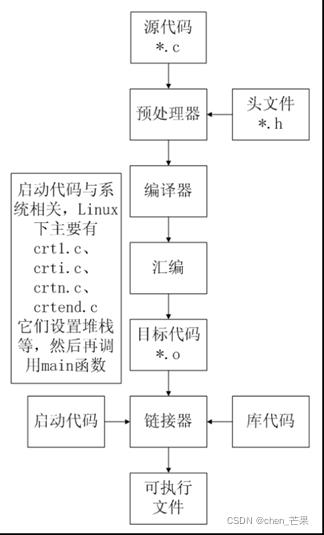
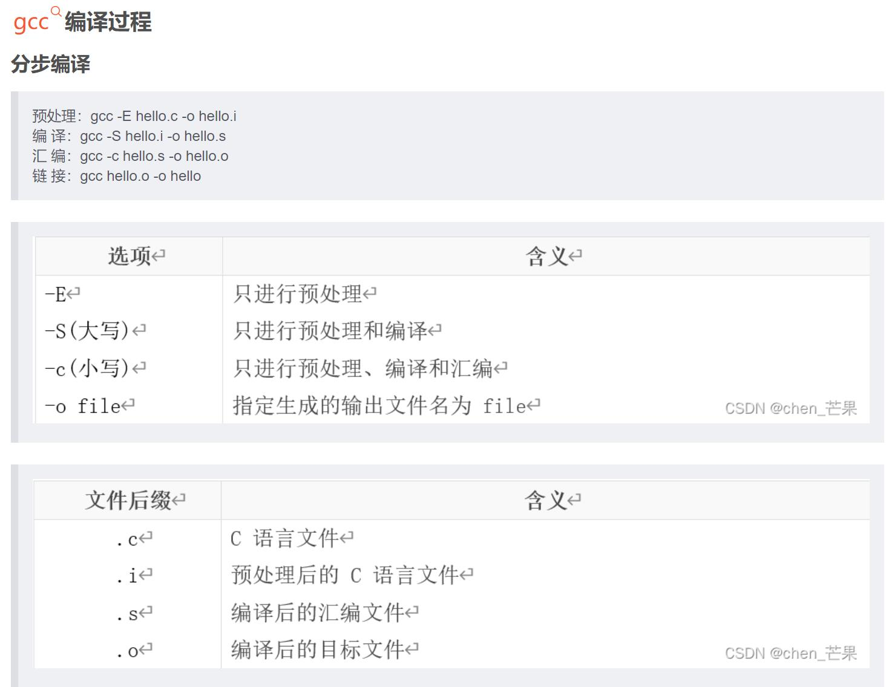
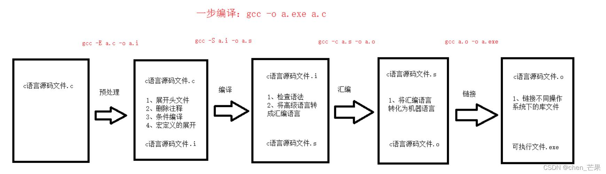
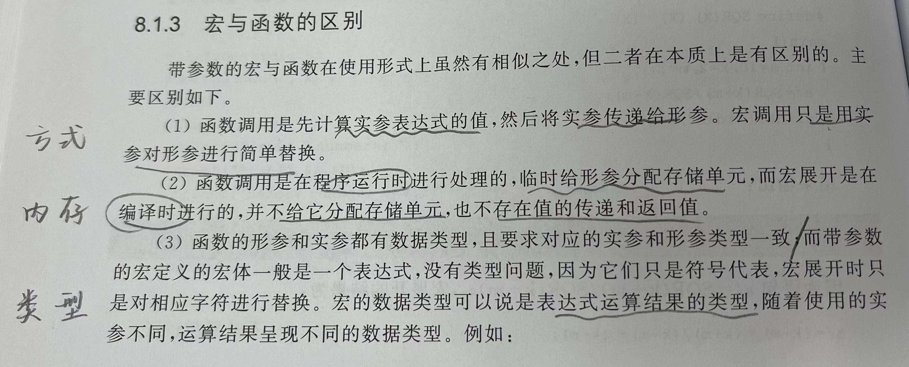
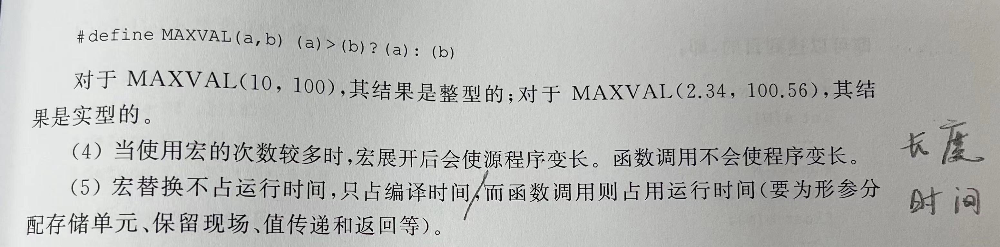

# chapter9 编译预处理命令
warm up 1：C语言编译过程
C代码编译成可执行程序经过4步：
（1）预处理：宏定义展开、头文件展开、条件编译等，同时将代码中的注释删除，这里并不会检查语法
（2）编译：检查语法，将预处理后文件编译生成汇编文件
（3）汇编：将汇编文件生成目标文件(二进制文件)
（4）链接：C语言写的程序是需要依赖各种库的，所以编译之后还需要把库链接到最终的可执行程序中去







其中
GCC的定义：

GCC原名为GNU C语言编译器（GNU C Compiler），是由GNU开发的编程语言译器，只能处理C语言。但其很快扩展，变得可处理C++，后来又扩展为能够支持更多编程语言，如Fortran、Pascal、Objective -C、Java、Ada、Go以及各类处理器架构上的汇编语言等，所以改名GNU编译器套件（GNU Compiler Collection）

GCC的工作过程：

GCC的外部接口长得像一个标准的Unix编译器。使用者在命令列下键入gcc之程序名，以及一些命令参数，以便决定每个输入档案使用的个别语言编译器，并为输出程序码使用适合此硬件平台的组合语言编译器，并且选择性地执行连接器以制造可执行的程序。


warm up 2：引入
编译预处理命令：向C编译程序发布信息或命令，只会编译系统在把源程序编译为目标程序之前对源程序先进行预先处理。

三类：宏定义、文件包含和条件编译

- 有助于程序的移植和调试，是模块化程序设计的一个工具。
- 为了和一般的C语句区分，所有的预处理命令都以#开头，一般单独占一行，且结尾不用分号
  如果一行写不下，可以在行尾放一个反斜杠'\'并回车，在下一行继续书写
- 一般放在源程序的首部，但也可以放在程序中的其他位置


## 1.宏定义
用宏名来代表一串字符，这个字符串可以使常数，也可以是任何字符串。
分为不带参数的宏和带参数的宏

### 1.1 不带参数的宏定义
`# define 宏名 宏体`
`功能：定义一个宏名带表示一个宏体。在C编译程序对源程序进行编译之前，即预处理阶段，预处理程序会将程序中出现的宏名，一律使用宏体进行替换（宏替换或宏展开）之后C编译程序再对替换处理后的源程序进行编译`
- 宏名：符合C标识符的命名规则，采用大、小写字母均可。一般使用大写字母！
- 宏体：常量、关键字、语句、表达式，也可以是空白
```
ex:
# define PI 3.14//常量
# define P x*y-1//语句
# define G (c=getchar()!='\n')//表达式
//上面的理解：从左到右理解语句，getchar给到c，再判断c是不是换行符就可以
...
while G 
...


# define STR "abcd"//字符串
printf("STR");//"STR"被看成字符串，不进行宏替换
printf(STR);//STR被看成宏名，进行替换！


```

> tip：
> ①程序中出现在“”之内的宏名被看做是普通字符串常量而不会被宏替换
> ②宏替换不进行语法检查，定义的时候结尾不能加;。如果加了；，会被当成宏体字符替换到语句之中！
> ③宏定义时允许使用已经定义过的宏名，即允许层层替换
> ex:
> `#define A 20    # define B A-5`


### 1.2带参数的宏定义--有点类似于lambda表达式啦
`#define 宏名（参数列表） 宏体`
- 此时宏体一般是一个表达式，其中应包含括号内指定的参数（形式参数），以后在程序中宏调用时，形式参数会被实际参数（调用的时候会给出）所替换
- 意义：让程序更加简介，使运算的意义更加明显清晰
```
ex:
# define MUL(x,y) x*y// MUL(x,y)是带参数的宏， x*y是宏体
//调用
a=MUL(5,10);
//会替换成a=x*y=5*10


# define MAX(x,y) ((x)>(y))?(x):(y) //求x和y之中的较大者
# define SWAP(t,x,y) {t=x;x=y;y=t}//交换x和y的值
```

tip：
① **对于宏展开后容易引起误会的表达式，在宏定义的时候需要用圆括号括住！**
```
#define SQR(x) x*x 
s=15/SQR(10);
这样就会是15/10*10
》》应修改为 #define SQR(x) ((x)*(x))
```
②**宏定义的时候，主义宏名和参数列表的圆括号之间不要有空格，否则系统会将空格之后的内容当做宏体被替换**


### 1.3宏与函数的区别




### 1.4宏定义的解除
宏定义的有效范围是从宏定义的命令之后直到源程序文件结束。
但宏定义的解除#undef 可以限制宏定义的作用域（可以解除带参数和不带参数的）+ 重新定义宏的含义
`# undef 宏名`

- 解除带参数的宏定义时，只需给出宏名不必给出参数！
  ex:
  #define S(R)...
  #undef S
- 实际应用时，可能会有多个源文件组成的程序，在不同的源文件之中可能会出现同名的宏名被定义为不同的宏体。
  合并到一起之后，会出现重复定义的错误。
  》》为了避免，**一般在每个源文件的末尾将本文件定义的所有宏名使用#undef 解除！！！**

_________

## 2.文件包含
一个程序文件把另外一个指定文件的全部内容包含进来
`#include<文件名>`
功能：在预处理的时候，用指定文件的内容替换该预处理命令行。
采用文件包含，可以将多个文件拼接在一起
```
法一：使用.c文件
ex：
1.c之中为自定义的函数或宏定义
2.c之中为主函数
```

头文件：
- .h是头文件，一般存放宏定义、结构体定义、全局变量定义、函数的声明、数组、和定义的变量。
  .c是源文件，是实现函数程序的功能。
- .h文件无法运行!!!更加安全，且更能表现此文件的性质

```
法二：使用.h文件
```

> 两种括文件的方式
> <>，预处理程序只在存放C库函数头文件的标准目录之中搜索要包含的文件（标准方式）
> ""，且没有指定文件所在目录的时候，预处理程序首先在源文件所在的目录之中寻找头文件，若找不到，再到标准目录之中搜索
> 》》所以统一用""来括住文件！


______________

## 3.条件编译
对部分程序，满足一定条件的时才编译执行。
》》使一个源程序在不同条件下能够编译产生不同的目标代码
在C语言之中一共有3中条件编译的形式

**3.1 #ifdef...#else...#endif**
```
#ifdef 标识符
  程序段1
#else//此段可以省略
  程序段2
#endif
```
功能：如果定义了标识符为宏名，则编译执行程序段1.否则执行程序段2.其中第二段可以省略

ex：

**3.2 #ifndef...#else...#endif**
```
#ifndef 标识符
  程序段1
#else//此段可以省略
  程序段2
#endif
```
功能：如果**没有**定义过标识符，则编译执行程序段1.否则编译程序段2！
**【和3.1的ifdef正好相反！】**

**（好！）3.3 #if...#elif...#else...#endif**
```
#if 表达式1
  程序段1
#elif 表达式2
  程序段2
#else 
  程序段n
#endif
```
功能：实现多重选择的条件编译命令。
若表达式1的值为“真”，编译#if之中的程序段。否则，如果表达式2为“真”，则编译#elif块的程序

- 格式中的表达式应是常量表达式，不能包含变量！所以经常和#define联用！
  **被#define定义的宏名为符号常量！！！用符号常量构成常量表达式！！！**


